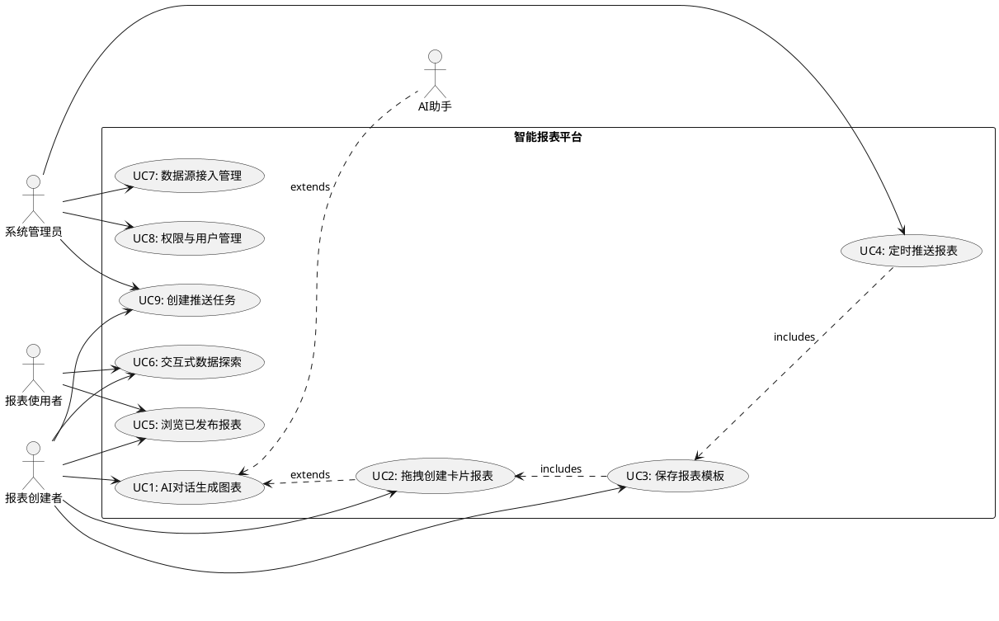
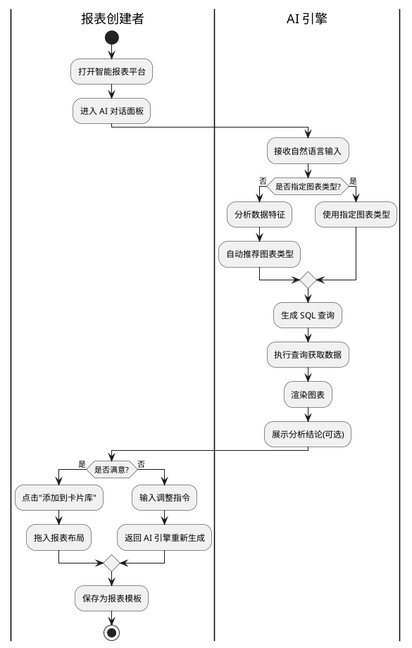
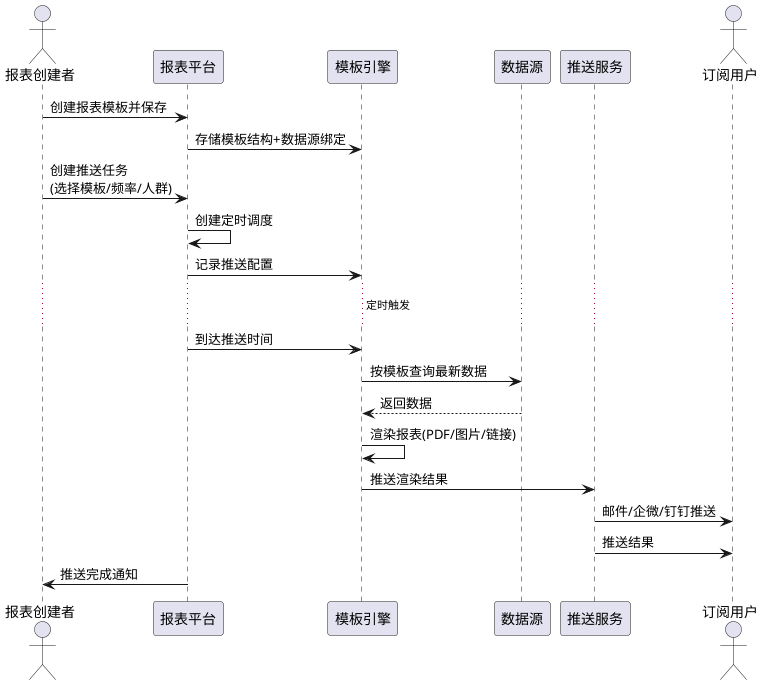
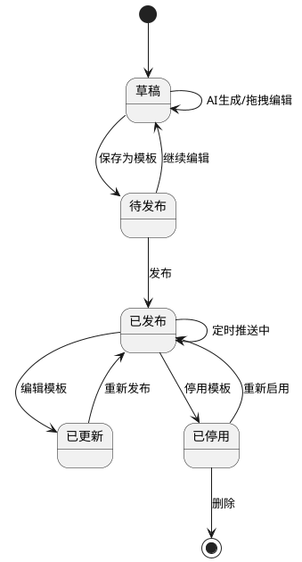

# 智能报表平台竞品调研报告

> 版本：v1.0 | 日期：20260701 | 调研深度：深度调研

---

## 一、调研目标确认单

| 确认项 | 内容 | 来源 |
|-------|------|------|
| 调研场景 | 港口集团级智能报表平台：AI 对话生成图表 + 自助拖拽卡片生成报告 + 模板定时推送 | 用户描述 |
| 目标客户 | 集团级多组织报表场景，不限行业 | 用户描述 |
| 目标竞品 | FineReport（帆软）+ 搜索补充 AI 报表/自助 BI 竞品 | 用户指定+搜索补充 |
| 调研深度 | 深度调研（功能矩阵 + UML 建模） | 用户确认 |
| 跨行业参考 | 是，BI 报表是通用场景 | 用户确认 |
| 输出要求 | 调研报告 + 功能清单对比表 + UML 图 + 参考资料清单 | 用户确认 |

---

## 二、行业概况

### 2.1 市场趋势

2025-2026 年是智能报表/Business Intelligence 赛道从"可视化工具"向"AI 决策引擎"转型的关键拐点。

**核心驱动因素**：
1. **ChatBI 成标配**：Gartner 预测到 2026 年 2/3 中国 500 强企业将采用 AI 驱动分析平台，自然语言问数、AI 自动图表生成成为入门门槛
2. **从"看报表"到"问答案"**：用户不再满足于被动查看预制报表，而是期望用自然语言提问、系统自动分析并给出结论
3. **AI Agent 化**：头部产品从 AI 辅助分析走向 AI 自主执行——Data Agent 成为新一代产品分水岭
4. **中国式复杂报表仍是国产壁垒**：多级表头、合并单元格、多源填报等需求国际产品始终难以满足
5. **信创适配加速**：国产数据库、国产 OS 适配成为政企客户的硬性要求

### 2.2 产业链结构

```
┌─────────────────────────────────────────────────────────────┐
│                    智能报表/BI 产业链                           │
├─────────────────────────────────────────────────────────────┤
│  数据源层            │  平台/引擎层          │  消费/应用层      │
│  ────────────────    │  ────────────────    │  ──────────────  │
│  • 数据库/数仓       │  • 数据接入与建模      │  • PC 端看板       │
│  • API/WebService    │  • 指标中心与治理      │  • 移动端推送       │
│  • Excel/CSV 文件    │  • AI 对话引擎 (ChatBI)│  • 大屏可视化      │
│  • 实时流数据        │  • 图表渲染与交互      │  • 定时报告订阅     │
│  • SaaS 应用数据     │  • 模板引擎与调度      │  • 嵌入式集成       │
└─────────────────────────────────────────────────────────────┘
```

### 2.3 主流玩家分类

| 类型 | 代表厂商 | 特点 |
|------|---------|------|
| 企业级综合 BI | 帆软 FineReport+FineBI、思迈特 Smartbi | 全链路覆盖，市场份额领先 |
| AI 原生 BI | 衡石 HENGSHI、数猎 Data Neo | AI Agent 架构，多智能体协同 |
| 云厂商 BI | 阿里 Quick BI、腾讯云 BI | 云原生，生态绑定 |
| 开源/轻量 BI | DataEase、JimuChatBI、Metabase | 低成本，灵活自建 |
| 嵌入式 BI | 葡萄城 Wyn、观远数据 | 可嵌入 OA/ERP 等业务系统 |
| 国际巨头 | Tableau、Power BI | 全球化，可视化领先 |

---

## 三、竞品分析

### 3.1 竞品列表

| 编号 | 竞品名称 | 厂商 | 类型 | 官网 |
|:----:|---------|------|------|------|
| P1 | FineReport 11.5 | 帆软 | 企业级综合 BI | https://www.finereport.com |
| P2 | FineBI + FineBINext | 帆软 | 企业级自助 BI | https://www.finebi.com |
| P3 | Smartbi 白泽 V5 | 思迈特 | 企业级多智能体 BI | https://www.smartbi.com |
| P4 | DataEase Skills | FIT2CLOUD | 开源 ChatBI | https://www.dataease.cn |
| P5 | Quick BI 智能小Q | 阿里云/瓴羊 | 云厂商 BI | https://www.alibabacloud.com |
| P6 | 衡石 HENGSHI Agentic BI | 衡石科技 | AI 原生 BI | https://www.hengshi.com |
| P7 | Tableau + Agent | Salesforce | 国际可视化标杆 | https://www.tableau.com |
| P8 | Power BI + Copilot | 微软 | 国际生态 BI | https://powerbi.microsoft.com |

### 3.2 产品定位对比

| 竞品 | 定位 | 目标客户 | 核心优势 |
|------|------|---------|---------|
| FineReport | 企业级中国式复杂报表+大屏 | 中大型企业/政企 | 中国式报表最强、填报闭环、定时调度完善 |
| FineBI | 全员自助分析+AI 引擎 | 中大型企业 | 指标中心统一口径、三级溯源、市场占有率第一 |
| Smartbi | 多智能体协同 AgentBI | 金融/央国企/制造 | 白泽 V5 多 Agent 架构、100+行业 AI 案例 |
| DataEase | 开源轻量 ChatBI | 中小企业/技术团队 | 开源免费、自然语言生成大屏、多组织支持 |
| Quick BI | 云原生 AI 对话分析 | 阿里云生态企业 | 千问大模型、智能小Q、首批信通院认证 |
| 衡石 | Data + AI Agent 架构 | AI 原生需求企业 | Agentic BI、自主执行分析闭环 |
| Tableau | 高级可视化探索分析 | 分析师/全球化企业 | 可视化美学标杆、交互细腻 |
| Power BI | 微软生态一体化 BI | 全规模/Office 用户 | Copilot 加持、Excel 天然协同、性价比高 |

---

## 四、详细功能清单对比表

### 4.1 AI 对话生成图表

| 功能项 | FineReport | FineBI | Smartbi | DataEase | Quick BI | 衡石 | Tableau | Power BI | 重要性 |
|--------|:--:|:--:|:--:|:--:|:--:|:--:|:--:|:--:|:--:|
| 自然语言问数查询 | ✅ 11.5新增 | ✅ | ✅ | ✅ | ✅ | ✅ | ✅ | ✅ | ⭐⭐⭐ |
| 自然语言生成图表 | ✅ | ✅ | ✅ | ✅ | ✅ | ✅ | ✅ | ✅ | ⭐⭐⭐ |
| 多轮对话上下文感知 | 部分 | ✅ | ✅ | ✅ | ✅ | ✅ | 部分 | ✅ | ⭐⭐⭐ |
| 图表类型自动推荐 | 部分 | ✅ | ✅ | 部分 | 部分 | ✅ | 部分 | ✅ | ⭐⭐ |
| AI 自动归因分析 | ❌ | ✅ | ✅ | ❌ | 部分 | ✅ | 部分 | 部分 | ⭐⭐ |
| AI 自动生成分析结论 | 部分 | ✅ | ✅ | ❌ | ✅ | ✅ | 部分 | 部分 | ⭐⭐ |
| 语义模型/指标中心 | 部分 | ✅ | ✅ | ✅ | ✅ | ✅ | 部分 | ✅ | ⭐⭐⭐ |

### 4.2 自助拖拽卡片式报表

| 功能项 | FineReport | FineBI | Smartbi | DataEase | Quick BI | 衡石 | Tableau | Power BI | 重要性 |
|--------|:--:|:--:|:--:|:--:|:--:|:--:|:--:|:--:|:--:|
| 拖拽式仪表板搭建 | ✅ | ✅ | ✅ | ✅ | ✅ | ✅ | ✅ | ✅ | ⭐⭐⭐ |
| 卡片/组件化布局 | ✅ | ✅ | ✅ | ✅ | ✅ | ✅ | ✅ | ✅ | ⭐⭐⭐ |
| 图表联动/下钻 | ✅ | ✅ | ✅ | ✅ | ✅ | ✅ | ✅ | ✅ | ⭐⭐⭐ |
| 自定义图表样式 | ✅ | ✅ | ✅ | 部分 | ✅ | ✅ | ✅ | ✅ | ⭐⭐ |
| 卡片自由排列/缩放 | ✅ | ✅ | ✅ | ✅ | ✅ | ✅ | ✅ | ✅ | ⭐⭐⭐ |
| 筛选器全局联动 | ✅ | ✅ | ✅ | ✅ | ✅ | ✅ | ✅ | ✅ | ⭐⭐⭐ |
| 多 Tab 页面 | ✅ | ✅ | ✅ | 部分 | ✅ | ✅ | ✅ | ✅ | ⭐⭐ |
| 移动端自适应布局 | ✅ | ✅ | ✅ | ✅ | ✅ | 部分 | ✅ | ✅ | ⭐⭐ |

### 4.3 模板保存与定时推送

| 功能项 | FineReport | FineBI | Smartbi | DataEase | Quick BI | 衡石 | Tableau | Power BI | 重要性 |
|--------|:--:|:--:|:--:|:--:|:--:|:--:|:--:|:--:|:--:|
| 报表模板保存 | ✅ | ✅ | ✅ | ✅ | ✅ | ✅ | ✅ | ✅ | ⭐⭐⭐ |
| 模板库/模板市场 | ✅ | ✅ | 部分 | 部分 | ✅ | 部分 | ✅ | ✅ | ⭐⭐ |
| 定时调度生成 | ✅ | ✅ | ✅ | ✅ | ✅ | ✅ | ✅ | ✅ | ⭐⭐⭐ |
| 多推送渠道（邮件/企微/钉钉） | ✅ | ✅ | ✅ 2025.09新增 | ✅ | ✅ | 部分 | ✅ | ✅ | ⭐⭐⭐ |
| 推送格式（PDF/Excel/图片/链接） | ✅ | ✅ | 截图+链接+附件 | 链接+截图 | ✅ | 部分 | ✅ | ✅ | ⭐⭐ |
| 按角色/人群定向推送 | ✅ | ✅ | ✅ | 部分 | ✅ | 部分 | ✅ | ✅ | ⭐⭐⭐ |
| 异常触发推送 | ✅ | ✅ | ✅ | ❌ | ✅ | ✅ | 部分 | ✅ | ⭐⭐ |
| 订阅管理 | ✅ | ✅ | ✅ Beta | 部分 | ✅ | 部分 | ✅ | ✅ | ⭐⭐ |

### 4.4 复杂中国式报表

| 功能项 | FineReport | FineBI | Smartbi | DataEase | Quick BI | 衡石 | Tableau | Power BI | 重要性 |
|--------|:--:|:--:|:--:|:--:|:--:|:--:|:--:|:--:|:--:|
| 多级表头/合并单元格 | ✅ | 部分 | ✅ | ❌ | 部分 | ❌ | ❌ | 部分 | ⭐⭐ |
| 多源填报 | ✅ | 部分 | ✅ | ❌ | ❌ | ❌ | ❌ | ❌ | ⭐⭐ |
| 复杂公式/计算 | ✅ | ✅ | ✅ | ✅ | ✅ | ✅ | ✅ | ✅ | ⭐⭐ |
| Excel 导入/导出 | ✅ | ✅ | ✅ | ✅ | ✅ | ✅ | ✅ | ✅ | ⭐⭐⭐ |
| 打印适配 | ✅ | ✅ | ✅ | 部分 | 部分 | 部分 | ✅ | ✅ | ⭐⭐ |

### 4.5 大屏可视化

| 功能项 | FineReport | FineBI | Smartbi | DataEase | Quick BI | 衡石 | Tableau | Power BI | 重要性 |
|--------|:--:|:--:|:--:|:--:|:--:|:--:|:--:|:--:|:--:|
| 大屏模板 | ✅ | ✅ | ✅ | ✅ | ✅ | ✅ | ✅ | ✅ | ⭐⭐⭐ |
| 三维场景孪生 | ✅ 11.5新增 | ❌ | 部分 | ❌ | ❌ | ❌ | ❌ | ❌ | ⭐⭐ |
| 数据地图/GIS | ✅ | ✅ | ✅ | ❌ | ✅ | 部分 | ✅ | ✅ | ⭐⭐⭐ |
| WebSocket 实时刷新 | ✅ | 部分 | ✅ | ❌ | ✅ | 部分 | ❌ | ✅ | ⭐⭐ |

### 4.6 数据接入与治理

| 功能项 | FineReport | FineBI | Smartbi | DataEase | Quick BI | 衡石 | Tableau | Power BI | 重要性 |
|--------|:--:|:--:|:--:|:--:|:--:|:--:|:--:|:--:|:--:|
| 数据源接入数量 | 60+ | 60+ | 50+ | 30+ | 40+ | 40+ | 90+ | 100+ | ⭐⭐⭐ |
| 指标中心/统一口径 | ❌ | ✅ | ✅ | ❌ | ✅ | ✅ | ❌ | 部分 | ⭐⭐⭐ |
| 行列级权限 | ✅ | ✅ | ✅ | 部分 | ✅ | ✅ | ✅ | ✅ | ⭐⭐⭐ |
| 数据脱敏 | ✅ | ✅ | ✅ | 部分 | ✅ | ✅ | 部分 | ✅ | ⭐⭐ |
| 信创适配 | ✅ | ✅ | ✅ | 部分 | ✅ | ✅ | ❌ | ❌ | ⭐⭐ |

### 4.7 部署与集成

| 功能项 | FineReport | FineBI | Smartbi | DataEase | Quick BI | 衡石 | Tableau | Power BI | 重要性 |
|--------|:--:|:--:|:--:|:--:|:--:|:--:|:--:|:--:|:--:|
| 私有化部署 | ✅ | ✅ | ✅ | ✅ | ❌ | ✅ | ✅ | 部分 | ⭐⭐⭐ |
| 嵌入式集成 | ✅ | ✅ | ✅ | ✅ | ✅ | ✅ | ✅ | ✅ | ⭐⭐ |
| 信创（国产OS/DB） | ✅ | ✅ | ✅ | 部分 | ✅ | ✅ | ❌ | ❌ | ⭐⭐ |
| 多租户/集团分级 | ✅ | ✅ | ✅ | ✅ | ✅ | ✅ | 部分 | ✅ | ⭐⭐⭐ |

---

## 五、UML 图

### 5.1 用例图（Use Case）



### 5.2 活动图（Activity）— AI 对话生成报表流程



### 5.3 时序图（Sequence）— 模板定时推送



### 5.4 状态机图（State）— 报表生命周期



---

## 六、竞品对比总结

### 7.1 竞品优势

| 竞品 | 核心优势 |
|------|---------|
| **FineReport** | 中国式复杂报表行业最强者；三维场景孪生+WebSocket 实时刷新；定时调度与推送体系最完善 |
| **FineBI** | 市场占有率连续 8 年第一；指标中心统一口径+三级溯源；FineBINext AI 引擎完备 |
| **Smartbi** | 多智能体协同 AgentBI 业界首创；100+行业 AI 案例；订阅推送 2025 年补齐 |
| **DataEase** | 开源免费无门槛；自然语言一键生成大屏；社区活跃迭代快 |
| **Quick BI** | 千问大模型加持；首批信通院 ChatBI 认证；阿里云生态深度绑定 |
| **衡石** | Agentic BI 新范式；Data + AI Agent 架构前瞻性最强 |
| **Tableau** | 可视化美学与交互体验业界标杆；全球化数据分析师首选 |
| **Power BI** | Office 生态天然协同；Copilot 加持性价比最高；数据源接入 100+ 最广 |

### 7.2 竞品短板

| 竞品 | 存在不足 |
|------|---------|
| **FineReport** | AI 能力在帆软产品线中偏 FineBI；复杂报表+大屏是强项，但自助探索偏弱 |
| **FineBI** | 中国式复杂报表不如 FineReport；本地化部署成本较高 |
| **Smartbi** | 订阅推送刚补齐（Beta），成熟度待验证；市场份额与帆软差距明显 |
| **DataEase** | 中国式复杂报表和填报能力弱；企业级权限治理不够成熟 |
| **Quick BI** | 强绑定阿里云生态；不支持私有化部署 |
| **衡石** | 市场品牌知名度较低；客户案例相对较少 |
| **Tableau** | 中国式报表几乎为 0；AI 分析侧重探索非报告生成；价格高 |
| **Power BI** | 中国式报表薄弱；信创不支持；国内本地化服务和响应偏慢 |

### 7.3 差异化机会

1. **AI 对话 + 卡片库 + 模板引擎三位一体**：目前没有竞品将这三者彻底融合——FineReport 强模板弱对话，Smartbi 强对话弱模板市场，衡石强 Agent 弱传统报表
2. **港口行业预置模板**：预置港口能耗分析、设备巡检分析、碳排放核算等主题模板，开箱即用
3. **集团级分级推送**：集团-分公司-基层三级差异化推送，上下级数据可见性可控
4. **"AI 生成卡片 → 人工拖拽拼装 → 保存模板 → 定时推送"全链路**：竞品通常只覆盖其中 2-3 个环节，完整链路是差异化
5. **私有化部署 + 信创适配**：Tableau/Power BI 无法做，Quick BI 不支持私有化，留下市场空白

---

## 七、功能优先级建议

| 优先级 | 功能项 | 理由 |
|--------|--------|------|
| **P0** | AI 对话生成单个图表 | 产品核心差异化的入口 |
| **P0** | 图表卡片库（添加/管理/复用） | AI 生成图表的归宿 |
| **P0** | 自助拖拽卡片生成报告 | 用户自助分析的载体 |
| **P0** | 报表模板保存 | 一切复用和推送的基础 |
| **P0** | 数据源接入（数据库/API/Excel） | 无数据则无报表 |
| **P1** | 定时推送（邮件/企微/钉钉） | 集团级核心刚需 |
| **P1** | 按人群定向推送 | 集团分级管理必需 |
| **P1** | 图表联动与下钻 | 交互分析体验 |
| **P1** | 模板市场/模板库 | 降低使用门槛 |
| **P2** | 中国式复杂报表（多级表头/合并） | 港口行业监管报送需要 |
| **P2** | 数据地图/GIS 可视化 | 港口地理信息展示 |
| **P2** | AI 自动归因分析 | 从"看数"到"知因" |
| **P2** | 大屏驾驶舱 | 集团管理层展示 |

---

## 八、参考资料清单

### 8.1 官网资料
1. [FineReport 帮助文档](https://help.fanruan.com/finereport/) - 帆软官网
2. [FineBI 产品介绍](https://www.finebi.com) - 帆软官网
3. [Smartbi 产品介绍](https://www.smartbi.com) - 思迈特官网
4. [DataEase Skills 发布](https://www.dataease.cn/blog/dataease-skills-bi-dialog-release.html) - DataEase 官网
5. [Quick BI 智能小Q](https://www.alibabacloud.com/help/zh/quick-bi/product-overview/intelligentq) - 阿里云
6. [衡石 Agentic BI 发布](https://www.hengshi.com/blog/1412.html) - 衡石科技

### 8.2 行业评测
7. [2026 主流 ChatBI 全维度横评](https://www.datahunter.cn/news/2026-zhu-liu-chatbi-quan-wei-du-heng-ping-zhi-neng-wen-shu-duo-zhi-neng-ti-yu-sheng-chan-luo-di-neng-li-shen-du-dui-bi/) - DataHunter
8. [2026年国内BI工具选型指南](https://www.finebi.com/uncategorized/2026年国内bi工具选型指南) - FineBI
9. [2026年BI自助分析工具推荐](https://software.it168.com/a2026/0701/6937/000006937703.shtml) - IT168

### 8.3 趋势分析
10. [AI 重构数据分析：技术突破与价值释放](https://www.grapecity.com.cn/blogs/ai-reinvents-data-analysis-technological-breakthroughs-and-value-unlocking) - 葡萄城
11. [国产报表软件AI功能有哪些？](https://www.finereport.com/blog/article/69dc53a512cf5a9eb17674d0) - 帆软博客
12. [AI报表如何提升数据洞察力](https://www.finereport.com/blog/article/69cdcd7312cf5a9eb12862e1) - 帆软博客

---

## 九、附录

### 9.1 术语表

| 术语 | 英文 | 定义 |
|------|------|------|
| ChatBI | Conversational BI | 基于自然语言对话的商业智能分析 |
| Data Agent | Data Agent | 能自主完成取数→分析→报告全流程的 AI 智能体 |
| 指标中心 | Metrics Store | 统一管理业务指标定义、口径和血缘的中心 |
| 卡片库 | Card Library | 可复用的图表卡片集合，每张卡片 = 一个图表+数据绑定 |
| 模板调度 | Template Scheduling | 按预设频率自动生成并推送报表 |
| RBAC | Role-Based Access Control | 基于角色的访问控制 |
| 信创 | 信息技术应用创新 | 国产化 IT 基础设施适配 |

### 9.2 调研方法记录

1. **信息来源**：搜索引擎（百度/Google）、厂商官网、行业评测平台、技术博客
2. **搜索关键词**：AI 报表、ChatBI、自助 BI、智能报表平台、FineReport、Smartbi、DataEase、Quick BI
3. **信息验证**：优先采信厂商官方文档和功能更新日志，辅助行业横评报告
4. **数据截止日期**：2026 年 7 月 1 日

---

> 调研完成时间：2026年7月1日 | 调研类型：智能报表平台竞品调研
