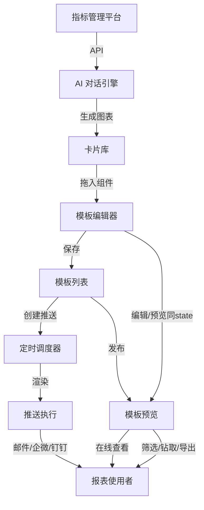
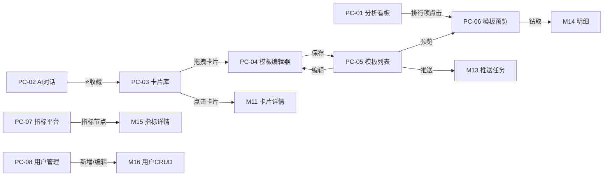

# 《智能报表2.0》产品需求规格说明书

> 版本号：V1.0
> 生成日期：2026-07-02
> 生成工具：PRD 生成 Skill（四阶段流水线 v3.0）
> 对应需求快照：R1.0
> 文档状态：初稿
> 确认人：___________
> 特别说明：基于竞品调研报告（8竞品/7模块/70+功能点）生成

---

## 第 1 章 产品概述

### 1.1 产品定位

**智能报表2.0** 是面向集团级多组织场景的 AI 驱动 BI 可视化平台。核心链路：「AI 对话生成图表 → 卡片库管理复用 → 自助拖拽拼装报告 → 模板保存发布 → 定时推送消费」。

**核心价值主张**：
- **报表使用者**：自然语言提问即可获得图表和分析结论，零技术门槛
- **报表创建者**：AI 生成图表 → 拖拽拼装 → 一键发布，效率提升 10x
- **管理层**：定时收到定制化报表推送，无需主动登录

**产品边界**：做报表的生成、拼装、推送、探索；不做数据仓库/ETL/数据治理。

### 1.2 目标用户画像

| 角色 | 典型岗位 | 核心任务 | 频率 | 关注点 |
|------|---------|---------|:--:|------|
| **报表使用者** | 业务经理/高层管理者 | 接收推送、在线查看、交互探索 | 每日/周 | 信息效率、推送及时性 |
| **报表创建者** | 数据分析师/业务骨干 | AI对话生成图表、拖拽拼装报告、配置推送 | 按需 | AI准确度、拖拽流畅度 |
| **系统管理员** | IT管理员 | 指标平台连接配置、用户与组织管理 | 低频 | 数据源稳定性、权限管控 |

### 1.3 核心使用场景

1. **AI 对话生成图表**：输入自然语言 → AI 意图识别 → SQL生成 → 数据查询 → 图表渲染+分析结论 → 收藏到卡片库
2. **自助拖拽创建报告**：拖入图表卡片/文本块/图片到画布 → 调整布局 → 添加筛选器 → 配置联动 → 保存模板
3. **模板定时推送**：选择模板 → 设定频率/时间/推送人 → 系统定时渲染最新数据并推送
4. **交互式数据探索**：打开报表 → 筛选器切换 → 图表联动下钻 → 导出 PDF/Excel/图片

### 1.4 约束与依赖

| 约束项 | 说明 |
|-------|------|
| 部署方式 | 私有化部署 |
| 数据源 | 对接外部指标管理平台（API获取指标目录和业务数据） |
| AI 模型 | 支持多模型切换（OpenAI/Claude/DeepSeek/通义千问） |
| 浏览器 | Chrome 90+ / Edge 90+ / Firefox 90+ |
| 信创 | 本期不做国产化适配 |

### 1.5 核心术语

| 术语 | 定义 |
|------|------|
| **ChatBI** | 基于自然语言对话的BI分析，用户用日常语言提问，系统返回图表和结论 |
| **卡片** | 独立图表单元，含图表类型、数据绑定、样式配置 |
| **卡片库** | 可复用图表卡片集合，按主题/来源/时间分类管理 |
| **文本块** | 支持 Markdown 的富文本组件，可在编辑器中拖入画布 |
| **报告** | 图表卡片+文本块+图片拼装而成的完整报表页面 |
| **报告模板** | 保存了组件布局和数据绑定的报告结构，可复用可定时生成 |
| **推送任务** | 定时调度配置，含模板、频率、推送人 |
| **指标平台** | 外部系统，统一管理业务指标定义、计算口径和数据 |

---

## 第 2 章 功能需求总览

### 2.1 功能基准矩阵（7模块 × 8竞品）

| 功能模块 | FineReport | FineBI | Smartbi | DataEase | Quick BI | 衡石 | Tableau | Power BI |
|---------|:--:|:--:|:--:|:--:|:--:|:--:|:--:|:--:|
| AI 对话生成图表 | ✅ | ✅ | ✅ | ✅ | ✅ | ✅ | ✅ | ✅ |
| 自助拖拽卡片报表 | ✅ | ✅ | ✅ | ✅ | ✅ | ✅ | ✅ | ✅ |
| 模板保存与复用 | ✅ | ✅ | ✅ | ✅ | ✅ | ✅ | ✅ | ✅ |
| 定时推送调度 | ✅ | ✅ | ✅Beta | ✅ | ✅ | 部分 | ✅ | ✅ |
| 图表联动与下钻 | ✅ | ✅ | ✅ | ✅ | ✅ | ✅ | ✅ | ✅ |
| 多数据源接入 | ✅60+ | ✅60+ | ✅50+ | ✅30+ | ✅40+ | ✅40+ | ✅90+ | ✅100+ |
| 指标中心/语义层 | ❌ | ✅ | ✅ | ❌ | ✅ | ✅ | ❌ | 部分 |

### 2.2 模块决策表

| 功能模块 | 决策 | 理由 |
|---------|:--:|------|
| **AI 对话引擎** | ✅ 增强 | 产品核心差异化入口，支持多模型切换和内联图表配置 |
| **卡片库管理** | ✅ 增强 | AI生成图表的归宿和复用枢纽，竞品多弱化此项 |
| **模板管理（编辑+发布+推送+消费）** | ✅ 增强 | 核心业务链路，竞品通常只覆盖其中2-3个环节 |
| **指标平台对接** | ✅ 新增 | 数据唯一入口，竞品多为多源接入模式；简化架构 |
| **分析看板** | ✅ 新增 | 平台自身运营数据全览，图表类型覆盖度测试场 |
| **大屏驾驶舱** | ❌ 不做 | 投入产出比低 |
| **中国式复杂报表** | ❌ 不做 | FineReport 已做到极致，非差异化方向 |
| **三维场景孪生** | ❌ 不做 | 投入产出比低 |

### 2.3 功能清单详版

#### 模块一：AI 对话引擎（8项）

| 编号 | 功能点 | 功能描述 | 优先级 |
|:----|------|---------|:--:|
| F01 | 对话面板 | 对话窗口，支持文本输入和多轮对话 | P0 |
| F02 | 自然语言转SQL | 输入业务问题 → AI 生成 SQL → 执行返回数据 | P0 |
| F03 | 图表自动生成 | 基于查询结果，AI 自动选择图表类型并渲染 | P0 |
| F04 | 图表类型推荐 | AI 分析数据特征，推荐最优可视化方式 | P1 |
| F05 | 多轮追问 | 上下文连续对话，支持修改指令 | P0 |
| F06 | 分析结论生成 | 图表下方 AI 自动生成 2-3 句数据洞察 | P1 |
| F07 | 模型切换 | 支持切换底层 AI 模型（OpenAI/Claude/DeepSeek/通义千问） | P1 |
| F08 | 对话历史 | 查看历史对话，支持回溯和继续 | P1 |

#### 模块二：卡片库管理（6项）

| 编号 | 功能点 | 功能描述 | 优先级 |
|:----|------|---------|:--:|
| F09 | 添加到卡片库 | AI 生成的图表一键保存 | P0 |
| F10 | 卡片库列表 | 网格/列表双视图，搜索和分类过滤 | P0 |
| F11 | 卡片预览 | 查看卡片大图和属性详情 | P1 |
| F12 | 卡片编辑 | 修改标题/图表类型/数据绑定/样式 | P0 |
| F13 | 卡片删除 | 二次确认后删除 | P0 |
| F14 | 卡片分类标签 | 自定义标签分类管理 | P1 |

#### 模块三：模板管理（15项）

| 编号 | 功能点 | 功能描述 | 优先级 |
|:----|------|---------|:--:|
| F16 | 画布拖拽 | 从组件库拖入图表卡片/文本块/图片到画布 | P0 |
| F17 | 组件缩放与排列 | 网格对齐、参考线、自适应 | P0 |
| F18 | 全局筛选器 | 日期/组织/维度筛选，作用于全部卡片 | P0 |
| F19 | 图表联动 | 点击某卡片数据点，其他卡片联动过滤 | P1 |
| F20 | 多 Tab 页 | 一个模板支持多个 Tab 页 | P1 |
| F21 | 撤销/重做 | 支持 50 步操作历史 | P1 |
| F22 | 布局模板 | 预置常用布局 | P1 |
| F23 | 保存为模板 | 编辑器内容保存为模板 | P0 |
| F24 | 模板列表 | 查看和管理已保存模板 | P0 |
| F25 | 模板编辑 | 基于已有模板修改后另存或覆盖 | P0 |
| F26 | 创建推送任务 | 选择模板→频率→时间→推送人 | P0 |
| F27 | 推送记录 | 历史推送状态查看，失败可重试 | P1 |
| F28 | 报表在线查看 | 已发布模板的在线浏览/筛选/钻取 | P0 |
| F29 | 图表交互 | tooltip/图例切换/缩放/联动 | P0 |
| F30 | 导出 | PDF/Excel/图片 | P1 |

#### 模块四：指标平台对接（5项）

| 编号 | 功能点 | 功能描述 | 优先级 |
|:----|------|---------|:--:|
| F31 | 连接配置 | API 地址和认证信息配置 | P0 |
| F32 | 指标目录浏览 | 按分类浏览可用指标 | P0 |
| F33 | 指标搜索 | 按关键字搜索指标 | P0 |
| F34 | 指标维度选择 | 选择指标后查看可用维度 | P0 |
| F35 | 连接测试 | 一键测试连接状态 | P0 |

#### 模块五：分析看板（8项）

| 编号 | 功能点 | 功能描述 | 优先级 |
|:----|------|---------|:--:|
| F39 | 核心指标卡片 | 模板总数/推送任务数/活跃用户/今日查看量 | P0 |
| F40 | 推送成功率趋势 | 近 30 天折线图，成功/失败双线 | P1 |
| F41 | 报表查看量趋势 | 近 7/30 天柱状图，点击下钻 | P1 |
| F42 | 模板使用排行 | TOP10 横向柱状图，点击跳转 | P1 |
| F43 | 模板分类分布 | 环形图，点击联动 | P1 |
| F44 | 用户活跃排名 | TOP10 表格，支持排序 | P1 |
| F45 | 全局筛选器 | 日期范围+组织筛选 | P0 |
| F46 | 图表联动 | 环形图→排行表+柱状图联动过滤 | P1 |

#### 模块六：系统管理（2项）

| 编号 | 功能点 | 功能描述 | 优先级 |
|:----|------|---------|:--:|
| F41b | 用户与角色管理 | 用户创建/编辑/删除/角色分配 | P0 |
| F42b | 组织架构管理 | 集团-港区-区域多级组织树 | P0 |

### 2.4 用户角色与权限矩阵

| 功能模块 | 报表使用者 | 报表创建者 | 系统管理员 |
|---------|:--:|:--:|:--:|
| **AI 对话引擎** | — | 使用 | 模型配置 |
| **卡片库** | — | 查看/创建/编辑/删除 | — |
| **模板编辑** | — | 创建/编辑/保存 | — |
| **模板推送** | 接收 | 创建推送任务 | — |
| **模板预览** | 查看已发布 | 查看全部/导出 | — |
| **指标平台对接** | — | — | 配置/同步 |
| **分析看板** | — | 查看 | — |
| **系统管理** | — | — | 全部权限 |

---

## 第 3 章 功能架构设计

### 3.1 功能模块结构图

```
智能报表2.0
│
├── 1. AI 对话引擎
│   ├── 对话面板 / NL2SQL
│   ├── 图表自动生成与类型推荐
│   ├── 多轮追问 / 分析结论生成
│   └── 模型切换 / 对话历史
│
├── 2. 卡片库管理
│   ├── AI 图表一键存入
│   ├── 卡片列表（网格/列表双视图 + 搜索/分类）
│   ├── 卡片预览与详情
│   └── 卡片编辑与删除
│
├── 3. 模板管理
│   ├── 编辑：画布拖拽 / 组件缩放 / 文本块(Markdown) / 图片 / 全局筛选器 / 图表联动 / 多Tab / 撤销重做 / 布局模板
│   ├── 存储：保存模板 / 模板列表 / 编辑修改
│   ├── 推送：创建推送任务 / 推送记录
│   └── 消费：在线查看 / 图表交互 / 导出
│
├── 4. 指标平台对接
│   ├── 连接配置 / 认证管理
│   ├── 指标目录浏览与搜索
│   └── 连接测试 / 指标同步
│
├── 5. 分析看板
│   ├── 核心指标卡片 / 推送成功率趋势
│   ├── 报表查看量趋势 / 模板使用排行
│   ├── 模板分类分布 / 用户活跃排名
│   └── 全局筛选器 / 图表联动下钻
│
└── 6. 系统管理
    ├── 用户与角色管理
    └── 组织架构管理（树形）
```

### 3.2 模块定位与分工

| 模块 | 定位 | 核心职责 |
|------|------|---------|
| AI 对话引擎 | 数据入口 | 将自然语言转化为图表，降低数据分析门槛 |
| 卡片库管理 | 资产沉淀 | 可复用图表卡片的集中管理和检索 |
| 模板管理 | 业务承载 | 报告拼装、模板存储、定时推送、在线消费 |
| 指标平台对接 | 数据底座 | 连接外部指标平台，提供指标目录和数据查询 |
| 分析看板 | 运营总览 | 平台自身运营数据全景监控 |
| 系统管理 | 权限底座 | 用户、角色、组织架构管理 |

### 3.3 模块业务依赖关系

```
                    ┌──────────────┐
                    │  6.系统管理   │ ← 用户权限控制
                    └──────┬───────┘
       ┌────────────────────┼──────────────────────┐
       ▼                    ▼                      ▼
┌──────────┐        ┌──────────┐          ┌──────────┐
│4.指标对接 │        │2.卡片库   │          │3.模板管理 │
└────┬─────┘        └────┬─────┘          └────┬─────┘
     │                   │                     │
     │ 数据源            │ AI图表入库           │ 组件来源
     ▼                   ▲                     ▲
┌──────────┐             │                     │
│1.AI对话   │─────────────┘                     │
│   引擎    │───────────────────────────────────┘
└──────────┘        分析看板 ← 平台自身数据
```

**依赖说明**：
- **AI 对话引擎** 依赖指标平台获取数据，产出存入卡片库
- **卡片库** 为模板编辑器提供可拖拽的图表组件
- **模板编辑器** 拼装卡片、文本、图片形成模板
- **分析看板** 消费平台自身运营数据，不依赖指标平台
- **系统管理** 为所有模块提供用户/组织/权限数据

---

## 第 4 章 系统核心业务流程

### 4.1 核心流程总览



### 4.2 关键业务节点说明

| 节点 | 触发方 | 处理逻辑 | 业务规则 |
|------|--------|---------|---------|
| **AI对话生成图表** | 报表创建者 | 自然语言→意图识别→检索指标→生成SQL→查询数据→推荐图表→渲染+摘要 | 支持多轮追问；AI不可访问指标平台以外数据 |
| **添加到卡片库** | 报表创建者 | 图表配置快照→分配卡片ID→分类存储 | 可复用、可编辑、可拖拽 |
| **拖拽拼装报告** | 报表创建者 | 组件库→拖入画布→调整大小位置→添加筛选器→配置联动 | 12列网格，不可重叠，自动避让 |
| **保存为模板** | 报表创建者 | 序列化画布状态→弹出M10填写名称/分类→保存 | 可被复用和推送 |
| **创建推送任务** | 报表创建者 | 选模板→频率(每日/每周/每月)→时间→推送人→M13确认 | 同一模板可创建多个任务 |
| **定时推送执行** | 系统调度器 | 扫描到期任务→获取最新数据→渲染报表→邮件/企微发送→记录结果 | 失败自动重试3次；3次均失败标记失败通知创建者 |
| **在线查看与交互** | 报表使用者 | 打开报表→筛选器刷新→图表钻取/联动→导出PDF/Excel/图片 | 含loading/空态/错误三态 |

### 4.3 系统间数据流转

```
外部系统                      智能报表2.0                        消费端
────────                    ────────────                      ──────
指标管理平台 ──REST API──→  指标对接模块  ──→  AI对话引擎
                             │                    │
                             │ 指标目录+业务数据    │ 图表卡片配置
                             ▼                    ▼
                           卡片库 ←───────────────┘
                             │
                             │ 可拖拽卡片
                             ▼
                           模板编辑器 ──→ 模板列表
                                           │
                              ┌────────────┼────────────┐
                              ▼            ▼            ▼
                          推送调度器    在线预览      导出服务
                              │            │            │
                              ▼            ▼            ▼
                          邮件/企微    Web浏览器    PDF/Excel
```

---

## 第 5 章 用户体验与页面结构设计

### 5.1 核心用户故事链

**故事一：AI 生成 → 拼装 → 推送**
数据分析师小张打开 AI 对话面板，输入"各港区上月能耗同比变化"。AI 返回一张折线图，他调整配色、修改标题、切换表格视图核对数据，点击⭐收藏到卡片库。接着进入模板编辑器，从组件库拖出图表卡片、文本块（Markdown 分析说明）、现场照片。调整布局后保存为"月度能碳报告"，创建推送任务——每月1号早8点推送给三个港区的设备主管。

**故事二：在线查看与探索**
港区经理陈总收到推送邮件，点击链接打开在线报表。他切换筛选器查看华南港区数据，点击碳排放环形图的某个扇区，下方排行表自动联动过滤。发现异常后导出 PDF 发给团队。

**故事三：分析看板审计**
管理员查看分析看板，切换日期范围查看近30天数据。点击"能碳"分类扇区，全页图表联动过滤。发现某模板查看量异常飙升，点击跳转到该模板预览页查看详情。

### 5.2 一级导航结构

侧边栏暗色主题（#001529），6个一级菜单，模板管理含3个子菜单：

```
📊 分析看板          → /dashboard
💬 AI 对话           → /ai-chat
🗂️ 卡片库            → /card-library
📋 模板管理          → /template-editor  （编辑器）
                    → /template-list     （列表）
                    → /template-preview  （预览）
🔌 指标平台          → /indicator-platform
⚙️ 系统管理          → /user-org
```

### 5.3 页面跳转关系



### 5.4 页面清单

| 编号 | 页面名称 | 类型 | 路由 | 归属模块 | 核心特征 |
|:----|---------|:---|------|---------|---------|
| PC-01 | 分析看板 | Dashboard | dashboard | 分析看板 | 4区域/15图表+2表格/全局筛选吸顶/图表联动下钻 |
| PC-02 | AI 对话 | Chat | ai-chat | AI对话引擎 | 模型切换/多轮对话/图表内联配置/表格视图切换 |
| PC-03 | 卡片库 | List+Grid | card-library | 卡片库管理 | 网格列表双视图/搜索过滤/拖拽到编辑器 |
| PC-04 | 模板编辑器 | Editor | template-editor | 模板管理 | 三栏/react-grid-layout 12列/编辑预览同state |
| PC-05 | 模板列表 | List | template-list | 模板管理 | 搜索排序/推送弹窗含历史摘要 |
| PC-06 | 模板预览 | Detail+Interactive | template-preview | 模板管理 | 筛选/联动/钻取弹窗/导出 |
| PC-07 | 指标平台对接 | Config+Tree | indicator-platform | 指标平台对接 | 连接表单/指标目录树/指标详情Drawer |
| PC-08 | 用户与组织管理 | Tree+Table | user-org | 系统管理 | 组织树+用户表联动/CRUD弹窗 |

---

## 第 6 章 页面详细设计

> 布局权威源为线框图（`02-产品设计/线框图/`），PRD 中不重复 ASCII 描述。每页含线框图引用、元素说明、交互行为表、异常处理表、弹窗清单。

### 6.1 分析看板 — 功能概述

平台运营数据全景 Dashboard，长滚动页面。全局筛选器吸顶，4大区域覆盖15种图表+2表格，图表间联动下钻。

**线框图**：`02-产品设计/线框图/PC-01-分析看板.excalidraw`

**页面元素说明**：

| 区域 | 元素 | 类型 | 数据绑定 |
|------|------|------|---------|
| 全局 | 筛选器 | DatePicker + Select×3 | 日期范围/组织/指标维度 |
| 区域一 | 统计卡片×4 | Card+Statistic+迷你ECharts | 模板总数/推送任务/活跃用户/今日查看量 |
| 区域一 | 仪表盘 | ECharts Gauge | 推送成功率 94.2% |
| 区域一 | 环形图 | ECharts Pie(radius内40%外70%) | 模板分类分布(5类) |
| 区域一 | 饼图×2 | ECharts Pie | 推送渠道/用户角色分布 |
| 区域二 | 折线+面积图 | ECharts Line(smooth)+Area | 近30天查看量趋势 |
| 区域二 | 分组柱状图 | ECharts Bar(grouped) | 三港区月度推送量 |
| 区域二 | 堆叠柱状图 | ECharts Bar(stacked) | 各组织查看量 |
| 区域二 | 散点图 | ECharts Scatter | 查看量-推送量关系 |
| 区域三 | 横向柱状图 | ECharts Bar(horizontal) | 模板TOP10 |
| 区域三 | 表格 | Table | 用户活跃排名TOP10 |
| 区域三 | 雷达图 | ECharts Radar(5轴) | 用户能力五维 |
| 区域三 | 漏斗图 | ECharts Funnel | 推送转化5阶段 |
| 区域四 | 桑基图 | ECharts Sankey | 指标→模板流向 |
| 区域四 | 树图 | ECharts Treemap | 组织→模板分布 |
| 区域四 | 表格 | Table | 最近推送记录 |

**交互行为**（从线框图标注提取）：

| 触发动作 | 前置条件 | 系统响应 | 反馈方式 |
|---------|---------|---------|---------|
| 切换全局筛选器 | — | 全部图表按条件刷新数据 | 各图表显示loading→更新 |
| 点击环形图扇区 | 环形图有数据 | 排行表+柱状图联动过滤为该分类 | 图表重绘+高亮 |
| 点击TOP10排行项 | 排行表有数据 | 跳转PC-06模板预览 | 页面跳转 |
| 图表tooltip悬停 | 图表有数据点 | 显示该数据点详细信息 | 浮层tooltip |
| 图例点击切换 | 图表有多系列 | 对应系列显示/隐藏 | 图表重绘 |
| 窗口resize | — | 全部图表自适应容器 | 图表resize() |

**异常处理**（从线框图标注提取）：

| 场景 | 系统行为 | 用户提示 |
|------|---------|---------|
| 图表数据为空 | 图表内显示空状态占位 | "暂无数据" |
| 图表渲染失败 | 单个图表占位+重试按钮 | "加载失败，点击重试" |
| 筛选后全页无数据 | 所有图表显示空状态 | "当前条件下暂无数据" |
| 页面初始加载 | 全局骨架屏 | — |

**关联弹窗**：无（本页为纯展示页，不涉及弹窗）

---

### 6.2 AI 对话（PC-02）

**线框图**：`02-产品设计/线框图/PC-02-AI对话.excalidraw`

**页面元素说明**：

| 区域 | 元素 | 类型 | 说明 |
|------|------|------|------|
| 顶部栏 | 模型选择 | Select | 多模型切换（Claude/DeepSeek/通义千问） |
| 顶部栏 | 新对话 | Button | 清空当前对话 |
| 对话区 | 用户消息气泡 | 蓝色底气泡 | 右对齐，含时间戳 |
| 对话区 | AI消息 | 灰色底卡片 | 含骨架屏(查询中)→图表+摘要 |
| 对话区 | 图表 | ReactECharts | AI动态选择类型，右上角⚙️📊🔗📥⭐按钮 |
| 对话区 | 内联配置面板 | Collapse | 点击⚙️展开：标题/类型/配色/重新生成/保存 |
| 对话区 | 分析摘要 | Text | 2-3句数据洞察+展开全文 |
| 底部 | 建议问题 | Tag列表 | 点击直接填入输入框 |
| 底部 | 输入框 | Input.TextArea | +发送按钮 |
| 侧边栏 | 对话历史 | List | 历史对话列表+点击回溯 |

**交互行为**：

| 触发动作 | 前置条件 | 系统响应 | 反馈方式 |
|---------|---------|---------|---------|
| 发送问题 | 输入框非空 | 用户消息添加→AI骨架屏→生成SQL→查询→渲染图表+摘要 | 骨架屏→图表渲染 |
| 点击⚙️ | 有AI图表 | 图表下方展开内联配置面板 | 面板展开动画 |
| 修改图表类型 | 配置面板打开 | 图表即时切换重绘 | 图表更新 |
| 点击📊 | 有AI图表 | 图表↔数据表格视图切换 | 视图切换 |
| 点击⭐ | 有AI图表 | 保存到卡片库 | Toast:"已收藏到卡片库" |
| 点击建议问题 | — | 自动填入输入框 | 输入框填充 |

**异常处理**：

| 场景 | 系统行为 | 用户提示 |
|------|---------|---------|
| AI无法理解 | 返回澄清引导 | "请具体说明分析维度，如按时间/区域/品类..." |
| 指标平台断开 | 返回错误状态 | "指标平台连接失败，请检查连接配置" |
| 查询超时 | 提示超时 | "查询超时，请尝试缩小数据范围" |
| 模型调用失败 | 返回错误+切换建议 | "当前模型调用失败，请尝试切换模型" |

**关联弹窗**：无

---

### 6.3 卡片库（PC-03）

**线框图**：`02-产品设计/线框图/PC-03-卡片库.excalidraw`

**页面元素说明**：

| 区域 | 元素 | 类型 | 说明 |
|------|------|------|------|
| 工具栏 | 搜索 | Input.Search | 按标题/类型搜索 |
| 工具栏 | 分类标签 | Tag(可点击) | 全部/能碳/设备/安全/商务/其他 |
| 工具栏 | 排序 | Select | 按时间/名称排序 |
| 工具栏 | 视图切换 | Button Group | 网格🟦/列表🟰 |
| 内容区 | 卡片网格 | Grid(24列) | 每卡片6列=4张/行，含缩略图+标题+类型+标签 |
| 内容区 | 卡片操作 | Dropdown(⋮) | Hover显示：编辑/复制/删除 |

**交互行为**：

| 触发动作 | 前置条件 | 系统响应 | 反馈方式 |
|---------|---------|---------|---------|
| 点击卡片 | 卡片存在 | 打开M11卡片详情弹窗 | 弹窗打开 |
| ⋮→编辑 | 卡片存在 | 打开M12编辑卡片弹窗 | 弹窗打开 |
| ⋮→复制 | 卡片存在 | 复制卡片到卡片库 | Toast:"已复制" |
| ⋮→删除 | 卡片存在 | 二次确认弹窗→删除 | Toast:"已删除" |
| 拖拽卡片缩略图 | 卡片存在 | 开始拖拽→可拖入PC-04画布 | 拖拽光标+阴影 |

**关联弹窗**：

| 编号 | 名称 | 触发 | 宽度 | 内容概要 |
|:--:|------|------|:--:|---------|
| M11 | 卡片详情 | 点击卡片 | 720px | 大图渲染+属性(标题/类型/数据源/创建时间/标签) |
| M12 | 编辑卡片 | ⋮→编辑 | 640px | 标题Input+类型Select+数据绑定Select+样式配置 |

**异常处理**：

| 场景 | 系统行为 | 用户提示 |
|------|---------|---------|
| 卡片库为空 | 空状态插画+引导按钮 | "从AI对话创建第一张卡片" [前往AI对话] |
| 搜索结果为空 | 空状态 | "未找到匹配的卡片" |

---

### 6.4 模板编辑器（PC-04）

**线框图**：`02-产品设计/线框图/PC-04-模板编辑器.excalidraw`

**页面元素说明**：

| 区域 | 元素 | 类型 | 说明 |
|------|------|------|------|
| 顶部栏 | 撤销/重做 | Button(disabled当栈空) | 50步历史，Ctrl+Z/Y |
| 顶部栏 | 预览切换 | Switch(isPreview) | 编辑/预览共用canvasItems+filters |
| 左侧 | 组件库 | Panel(240px) | 图表卡片(可搜索)/文本块(Markdown)/图片 |
| 中间 | 画布 | react-grid-layout | 12列grid，rowHeight=8，compactType=vertical |
| 右侧 | 属性面板 | Panel(320px) | 按选中组件类型切换内容 |

**核心机制**：
```
const [isPreview, setIsPreview] = useState(false)
const [canvasItems, setCanvasItems] = useState([])
const [filters, setFilters] = useState({})
// isPreview切换：隐藏编辑UI，canvasItems和filters不变
// → 预览看到的就是编辑后的结果
```

**交互行为**：

| 触发动作 | 前置条件 | 系统响应 | 反馈方式 |
|---------|---------|---------|---------|
| 从组件库拖入画布 | — | 新增卡片，自动吸附12列网格 | 画布更新 |
| 画布卡片缩放 | 卡片存在 | 容器resize→ECharts resize() | 实时预览 |
| 切换isPreview | — | 隐藏编辑UI，保留canvasItems+filters | 视图切换 |
| 右键画布卡片 | 卡片存在 | 右键菜单：编辑/复制/删除/置顶/置底 | 菜单弹出 |
| Ctrl+Z | 撤销栈非空 | 撤销上一步操作 | 画布更新 |
| 点击保存 | — | 打开M10保存弹窗 | 弹窗打开 |

**关联弹窗**：

| 编号 | 名称 | 触发 | 宽度 | 内容概要 |
|:--:|------|------|:--:|---------|
| M10 | 保存模板 | 点击保存 | 480px | 模板名称Input+分类Select+描述TextArea |

**异常处理**：

| 场景 | 系统行为 | 用户提示 |
|------|---------|---------|
| 画布为空 | 空状态插画+引导文字 | "从左侧拖拽组件开始创建报告" |
| 撤销栈为空 | 撤销按钮disabled | — |
| 重做栈为空 | 重做按钮disabled | — |
| 删除组件 | 二次确认弹窗 | "确定删除该组件？" |

---

### 6.5 模板列表（PC-05）

**线框图**：`02-产品设计/线框图/PC-05-模板列表.excalidraw`

**页面元素说明**：

| 区域 | 元素 | 类型 | 说明 |
|------|------|------|------|
| 工具栏 | 搜索 | Input.Search | 按名称搜索 |
| 工具栏 | 分类标签 | Tag(可点击) | 全部/能碳/设备/安全/商务/其他 |
| 工具栏 | 新建模板 | Button(primary) | 跳转PC-04 |
| 内容区 | 模板表格 | Table | 名称/分类/卡片数/推送状态Tag/更新时间/操作 |

**交互行为**：

| 触发动作 | 前置条件 | 系统响应 | 反馈方式 |
|---------|---------|---------|---------|
| 点击模板行 | 模板存在 | 跳转PC-06预览 | 页面跳转 |
| 编辑按钮 | 模板存在 | 跳转PC-04加载模板 | 页面跳转 |
| 推送按钮 | 模板存在 | 打开M13推送弹窗 | 弹窗打开 |
| 新建模板 | — | 跳转PC-04 | 页面跳转 |

**关联弹窗**：

| 编号 | 名称 | 触发 | 宽度 | 内容概要 |
|:--:|------|------|:--:|---------|
| M13 | 创建推送任务 | 点击推送 | 560px | 模板→频率(日/周/月)→时间→推送人→确认。底部：该模板最近5条推送记录折叠 |

**异常处理**：

| 场景 | 系统行为 | 用户提示 |
|------|---------|---------|
| 模板列表为空 | 空状态 | "暂无模板" |
| 推送人列表为空 | 弹窗内提示 | "请先在系统管理中添加用户" |

---

### 6.6 模板预览（PC-06）

**线框图**：`02-产品设计/线框图/PC-06-模板预览.excalidraw`

**页面元素说明**：

| 区域 | 元素 | 类型 | 说明 |
|------|------|------|------|
| 顶部 | 筛选器 | DatePicker+Select | 刷新全页数据 |
| 顶部 | 导出按钮 | Button Group | PDF/Excel/图片 |
| 内容 | 模板渲染区 | 图表+文本+图片 | 完整渲染模板内容 |

**交互行为**：

| 触发动作 | 前置条件 | 系统响应 | 反馈方式 |
|---------|---------|---------|---------|
| 切换筛选器 | — | 全页卡片加载最新数据 | loading→图表刷新 |
| 点击图表数据点 | 图表有数据 | 打开M14钻取明细弹窗 | 弹窗打开 |
| 点击图表扇区/柱子 | 图表有分类 | 其他图表联动过滤为国家分类 | 图表联动重绘 |
| 图例切换 | 图表有多系列 | 对应系列显示/隐藏 | 图表重绘 |
| 导出按钮 | — | 生成对应格式下载 | 浏览器下载 |

**关联弹窗**：

| 编号 | 名称 | 触发 | 宽度 | 内容概要 |
|:--:|------|------|:--:|---------|
| M14 | 数据钻取明细 | 点击数据点 | 800px | 明细数据表格+排序+搜索+导出 |

**异常处理**：

| 场景 | 系统行为 | 用户提示 |
|------|---------|---------|
| 报表不存在 | 错误页面 | "报表已失效或被删除" |
| 筛选后无数据 | 各图表空状态 | "暂无数据" |
| 加载中 | 骨架屏 | — |

---

### 6.7 指标平台对接（PC-07）

**线框图**：`02-产品设计/线框图/PC-07-指标平台对接.excalidraw`

**页面元素说明**：

| 区域 | 元素 | 类型 | 说明 |
|------|------|------|------|
| 配置区 | 连接表单 | Form | 名称/API地址/认证方式/API Key |
| 配置区 | 测试连接 | Button | loading→Toast成功/失败 |
| 配置区 | 同步指标 | Button | loading→"同步完成，共N个指标" |
| 目录区 | 指标搜索 | Input.Search | 实时过滤指标树 |
| 目录区 | 指标目录树 | Tree(可折叠) | 5分类→指标节点 |

**交互行为**：

| 触发动作 | 前置条件 | 系统响应 | 反馈方式 |
|---------|---------|---------|---------|
| 测试连接 | 表单已填 | 调用API验证→返回结果 | Toast:"连接成功"或"连接失败：{原因}" |
| 同步指标 | 连接成功 | 拉取指标列表→更新树 | Toast:"同步完成，共N个指标" |
| 点击指标节点 | 指标存在 | 打开M15 Drawer | Drawer右侧滑出 |
| 搜索指标 | — | 实时过滤指标树 | 树节点过滤显示 |

**关联弹窗**：

| 编号 | 名称 | 触发 | 类型 | 宽度 | 内容概要 |
|:--:|------|------|:--:|:--:|---------|
| M15 | 指标详情 | 点击指标节点 | Drawer | 480px | 指标定义/计算口径/可用维度/数据预览 |

**异常处理**：

| 场景 | 系统行为 | 用户提示 |
|------|---------|---------|
| 连接测试失败 | Toast错误 | "连接失败：{错误信息}" |
| 指标目录为空 | 空状态 | "暂无可用指标，请检查连接配置" |
| API超时 | Toast错误 | "请求超时，请重试" |

---

### 6.8 用户与组织管理（PC-08）

**线框图**：`02-产品设计/线框图/PC-08-用户与组织管理.excalidraw`

**页面元素说明**：

| 区域 | 元素 | 类型 | 说明 |
|------|------|------|------|
| 左侧 | 组织树 | Tree | 集团→港区→区域三级 |
| 右侧 | 用户搜索 | Input.Search | 按姓名/工号搜索 |
| 右侧 | 角色/状态筛选 | Select | 过滤条件 |
| 右侧 | 用户表格 | Table | 姓名/工号/角色Tag/组织/状态Tag/操作 |

**交互行为**：

| 触发动作 | 前置条件 | 系统响应 | 反馈方式 |
|---------|---------|---------|---------|
| 点击组织树节点 | — | 右侧用户表过滤为该组织下用户 | 表格刷新 |
| 新增用户 | — | 打开M16弹窗 | 弹窗打开 |
| 编辑用户 | 用户存在 | 打开M16弹窗(预填数据) | 弹窗打开 |
| 删除用户 | 用户存在 | 二次确认弹窗 | "确定删除用户{姓名}？"→Toast |
| 禁用/启用 | 用户存在 | 即时切换状态Tag | Tag颜色变更 |

**关联弹窗**：

| 编号 | 名称 | 触发 | 宽度 | 内容概要 |
|:--:|------|------|:--:|---------|
| M16 | 用户CRUD | 新增/编辑 | 560px | 姓名/工号/角色Select/组织TreeSelect/手机号/密码/状态Switch |

**异常处理**：

| 场景 | 系统行为 | 用户提示 |
|------|---------|---------|
| 组织树为空 | 空状态 | "暂无组织数据" |
| 用户表为空 | 空状态 | "该组织下暂无用户" |
| 删除确认 | 二次确认弹窗 | "确定删除用户{姓名}？此操作不可恢复" |

---

### 6.9 弹窗汇总

| 编号 | 名称 | 所属页面 | 类型 | 宽度 | 核心字段 |
|:--:|------|:--:|:--:|:--:|---------|
| M10 | 保存模板 | PC-04 | Modal | 480px | 名称/分类/描述 |
| M11 | 卡片详情 | PC-03 | Modal | 720px | 大图渲染+属性信息 |
| M12 | 编辑卡片 | PC-03 | Modal | 640px | 标题/类型/数据绑定/样式 |
| M13 | 创建推送任务 | PC-05 | Modal | 560px | 模板/频率/时间/推送人+历史推送摘要 |
| M14 | 数据钻取明细 | PC-06 | Modal | 800px | 明细表格+排序+搜索+导出 |
| M15 | 指标详情 | PC-07 | Drawer | 480px | 定义/口径/维度/数据预览 |
| M16 | 用户CRUD | PC-08 | Modal | 560px | 姓名/工号/角色/组织/手机号/密码/状态 |

---

## 第 7 章 非功能需求

### 7.1 性能需求

| 编号 | 需求项 | 指标 |
|:----|------|------|
| PF01 | AI对话生成图表响应 | ≤10秒 |
| PF02 | 图表渲染（单个） | ≤1秒 |
| PF03 | 分析看板全页加载 | ≤5秒 |
| PF04 | 拖拽操作流畅度 | 60fps |
| PF05 | 卡片缩放响应 | ≤100ms |
| PF06 | 模板推送执行 | ≤30秒 |
| PF07 | 指标目录同步 | ≤60秒 |
| PF08 | 并发在线 | 50人 |
| PF09 | 图表联动响应 | ≤500ms |

### 7.2 安全合规

| 编号 | 需求项 | 要求 |
|:----|------|------|
| SC01 | 身份认证 | 密码≥8位，含大小写+数字 |
| SC02 | 权限控制 | RBAC，按2.4权限矩阵 |
| SC03 | 指标平台认证 | API Key加密存储，HTTPS传输 |
| SC04 | 推送链接安全 | 一次性Token，有效期7天 |
| SC05 | 数据备份 | 模板和卡片配置每日自动备份，保留30天 |

### 7.3 可用性需求

| 编号 | 需求项 | 要求 |
|:----|------|------|
| AV01 | AI对话体验 | 多轮上下文理解/骨架屏/追问建议 |
| AV02 | 编辑器防误操作 | 撤销50步/未保存提醒/删除二次确认 |
| AV03 | 空状态引导 | 所有列表/画布空状态含引导文案+操作入口 |
| AV04 | 错误提示 | 中文，含问题描述+建议操作 |
| AV05 | 图表自适应 | 容器resize时自动重绘(resize listener) |
| AV06 | 表单防重复 | 提交按钮点击后禁用2秒 |
| AV07 | 浏览器兼容 | Chrome/Edge/Firefox 90+ |

### 7.4 部署需求

| 编号 | 需求项 | 要求 |
|:----|------|------|
| DP01 | 部署方式 | 私有化部署 |
| DP02 | 服务器配置 | 4核/16GB/200GB SSD/Linux |
| DP03 | 数据库 | PostgreSQL 14+ 或 MySQL 8.0+ |
| DP04 | AI模型 | 支持多模型 API Key 接入 |

---

## 第 8 章 核心业务闭环验证

### 8.1 闭环说明

选取5条贯穿多页面的端到端流程作为业务闭环验证。

### 8.2 闭环详情

| ID | 闭环名称 | 涉及页面 | 操作步骤 | 预期结果 |
|:--:|------|---------|---------|---------|
| CL-01 | AI生成→收藏→拼装→推送 | PC-02→PC-03→PC-04→PC-05 | 1.PC-02输入问题 2.AI返回图表 3.⭐收藏 4.PC-03查看卡片 5.拖入PC-04画布 6.保存模板 7.PC-05创建推送 | 推送任务创建成功 |
| CL-02 | 推送→查看→探索 | PC-05→PC-06 | 1.PC-05推送触发 2.用户打开PC-06链接 3.切换筛选器 4.图表钻取M14 5.导出PDF | 报表完整渲染，导出成功 |
| CL-03 | 看板审计→跳转详情 | PC-01→PC-06 | 1.PC-01切换日期 2.查看趋势 3.点击环形图扇区联动 4.点击TOP10模板名→PC-06 | 联动正确，跳转正常 |
| CL-04 | 指标连接→AI查询 | PC-07→PC-02 | 1.PC-07配置连接 2.测试连接成功 3.同步指标 4.切换到PC-02 5.AI对话引用指标 | AI能访问指标数据 |
| CL-05 | 用户管理→权限生效 | PC-08→PC-03 | 1.PC-08新增用户 2.分配角色 3.该用户登录 4.按权限矩阵可见对应功能 | 权限隔离正确 |

---

## 附录A：迭代变更记录

> V1.0 初稿，基于四阶段流水线 v3.0 流程生成。

## 附录B：版本快照历史

```
【需求快照 R1.0】
生成时间：2026-07-02
产品正式全称：智能报表2.0
本次变更级别：-
变更内容：全文定稿（初稿）
文档状态：初稿
```

## 附录C：全流程自检报告

| 检查阶段 | 检查内容 | 结果 |
|---------|---------|:--:|
| 步骤二 | 大纲章节完整 / 产品名称已确认 | ✅ |
| 第1章 | 产品定位/用户/场景/约束/术语完整 | ✅ |
| 第2章 | 功能模块无遗漏 / 角色权限无冲突 | ✅ |
| 第3章 | 功能架构与第2章功能清单一致性 | ✅ |
| 第4章 | 业务流程闭环 / 系统间数据流完整 | ✅ |
| 第5章 | 页面清单完整 / 一级菜单都有落地页 / 跳转覆盖率100% | ✅ |
| 第6章 | 每页无线框图引用 / 交互/异常/弹窗三表完备 | ✅ |
| 第7章 | 非功能需求与实际架构匹配 | ✅ |
| 第8章 | 5条闭环覆盖核心故事链 / 跨页面流程验证 | ✅ |
| 线框图 | 8页 = 8线框图 / 交互标注→PRD交互表 / 异常标注→PRD异常表 | ✅ |
| 弹窗 | 7个弹窗(M10-M16)覆盖完整 / 3×Dialog+1×Drawer | ✅ |
| 终稿 | 全文档术语一致 / 产品名称"智能报表2.0"全文统一 | ✅ |
