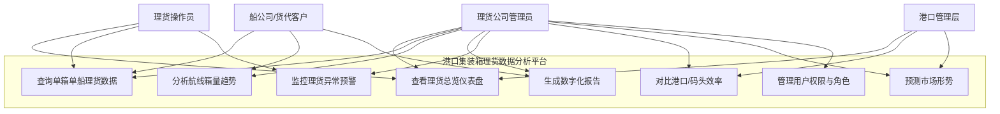
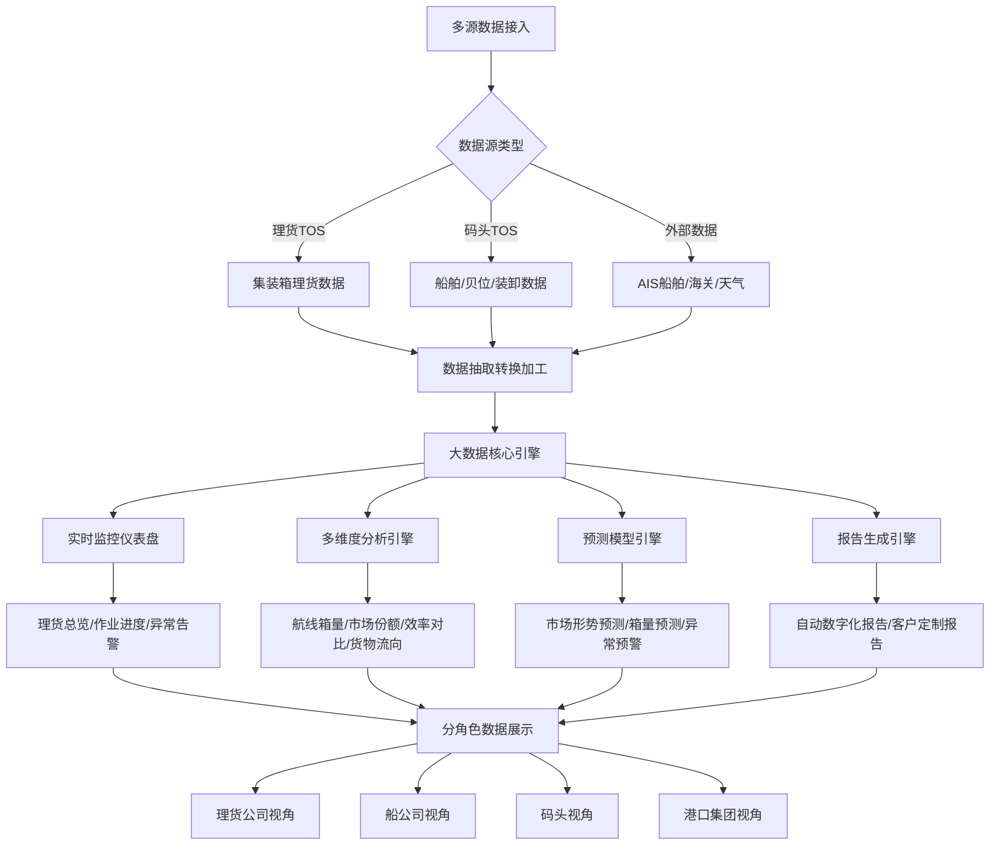
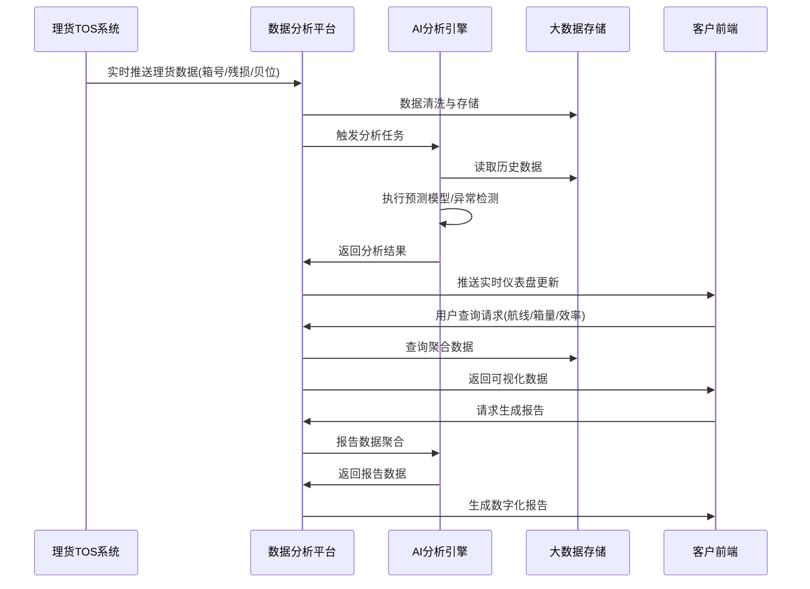
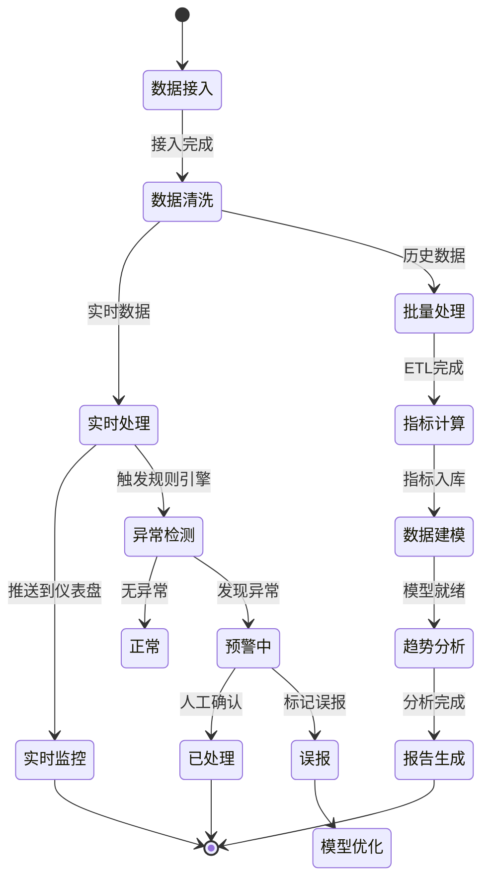

# 港口集装箱理货数据分析平台 — 竞品调研报告

> 版本：v1.0 | 日期：2026-07-03 | 调研深度：标杆对比 | 调研覆盖：8 家直接竞品 + 6 家泛行业标杆 + 5 家跨界参考

---

## 一、调研目标确认单

| 确认项 | 内容 | 来源 |
|-------|------|------|
| 产品定位 | 港口集装箱理货数据分析平台 | 用户确认 |
| 目标客群 | 理货公司 / 第三方理货服务商 | 用户确认 |
| 调研深度 | 标杆对比（功能级 + 架构级） | 用户确认 |
| 调研范围 | 全面覆盖（直接竞品 + 泛行业标杆 + 垂直跨界） | 用户确认 |
| 输出要求 | 完整调研报告（含功能矩阵、UML图、差异化机会、优先级建议） | 模板规范 |

---

## 二、行业概况

### 2.1 市场趋势

中国智慧港口市场正处于高速增长期：

| 年份 | 市场规模（亿元） | 增速 |
|------|:---------:|:----:|
| 2018 | 13.34 | — |
| 2023 | 44.24 | ~27% CAGR |
| **2024** | **约53** | +20% |
| **2025E** | **约60-65** | +15-20% |
| 2027E | 约111（共研网预测） | ~25% CAGR |

> 注：各机构统计口径不同（狭义软件 vs 广义含设备），此处取交集区间。数据来源：中研产业研究院、普华有策、共研网。

**核心驱动力**：
- **技术成熟**：5G 商业化普及、AI 大模型、数字孪生、边缘计算深度应用
- **政策推动**：交通强国战略、"十四五"智慧港口专项规划、交通运输部《关于加快智慧港口和智慧航道建设的意见》
- **需求倒逼**：人力成本攀升，理货员减少 60-80% 成为行业基准线
- **信创要求**：全栈国产化（芯片+OS+数据库+算力）从可选项变为刚需

### 2.2 产业链结构

```
┌──────────────────────────────────────────────────────────┐
│                    港口集装箱理货产业链                       │
├──────────┬──────────┬──────────┬──────────┬──────────────┤
│ 硬件层   │  感知层   │  平台层   │  应用层   │   消费层      │
├──────────┼──────────┼──────────┼──────────┼──────────────┤
│ 高清摄像机 │ OCR识别  │ 理货TOS  │ 智能理货  │ 理货公司      │
│ 激光雷达  │ AI视觉   │ 数据中台  │ 数据分析  │ 船公司/货代   │
│ 边缘工控机 │ 5G/物联网 │ 大数据平台│ 客户服务  │ 港口集团      │
│ 国产芯片  │ 区块链   │ 数字孪生  │ 经营决策  │ 海关/监管     │
└──────────┴──────────┴──────────┴──────────┴──────────────┘
```

本产品的定位处于**平台层与应用层的交汇点**——以理货数据分析为核心，向上支撑经营决策与客户服务。

### 2.3 主流玩家格局

```
                     AI 技术领先度
                          ↑
                          │
              ┌───────────┼───────────┐
              │  西井科技  │           │
              │ (VLM大模型) │  天津随行  │
              │           │ (5G+边缘)  │
              ├───────────┼───────────┤
              │  平方科技  │  哪吒科技  │
              │ (国产化)   │ (全流程)   │
              │           │           │
              └───────────┴───────────┘
                          →
                    港口业务覆盖深度
```

**第一梯队**（技术+市场双领先）：西井科技、平方科技、哪吒智慧科技
**第二梯队**（港口集团自研/深度绑定）：天津随行科技、山东方舟智能、广州外理
**第三梯队**（基础设施/平台底座）：星环科技、中国电科

---

## 三、竞品分析

### 3.1 竞品选取逻辑

| 类别 | 数量 | 选取逻辑 |
|------|:---:|---------|
| **直接竞品** | 5 家 | 同赛道集装箱智能理货系统/平台厂商 |
| **港口集团方案** | 3 家 | 头部港口自研或深度合作的理货数据分析方案 |
| **泛行业标杆** | 6 家 | 物流/供应链/工业领域顶级数据分析平台 |
| **国际参考** | 4 家 | 全球港口数据分析与社区系统标杆 |

### 3.2 直接竞品详细分析

---

#### 竞品 1：平方科技 — 集装箱智能理货系统

| 维度 | 详情 |
|------|------|
| **公司** | 深圳市平方科技股份有限公司（新三板 831254） |
| **成立** | 2005 年 |
| **官网** | www.pingfang.net |
| **定位** | 全球领先的港口码头信息化专业供应商 |
| **覆盖** | 全球 30+ 国家，前 20 大集装箱码头超 50% 采用 |
| **客群** | 港口码头运营方、理货公司 |

**产品矩阵**：

| 子系统 | 功能 |
|--------|------|
| **集装箱智能理货系统** | Web 架构中央管控：实时监控、AI 识别、自动匹配核销、遇错拦截、残损检测、贝位图形化、1对N 作业、视频记录 |
| **AI 岸桥识别系统** | 多部高清摄像机 + AI 边缘计算，前端识别箱号/拖车号/残损 |
| **AI 门机识别系统** | 门机装卸自动识别箱号/ISO 代码/拖车号 |
| **AI 线扫描识别系统** | 面阵+线阵相机抓拍五面，自动识别与残损检测 |
| **云识别解决方案** | SaaS OCR 服务，API 形式，箱号识别率 >98% |

**核心优势**：
- 市场份额领先（全球 top20 码头超 50%）
- 2026 年发布全栈国产化方案（国产硬件+OS+数据库+算力深度适配）
- 与中国外理深度合作，面向"十五五"理货 5.0 升级
- 产品矩阵最完整——从硬件感知到软件平台全覆盖

**关键短板**：
- 数据分析能力偏弱，侧重理货操作执行而非数据分析决策
- 客户服务数据分析功能不够突出
- 产品页面展示的系统界面偏传统

---

#### 竞品 2：哪吒智慧科技（NIZE）— 智能理货管控平台

| 维度 | 详情 |
|------|------|
| **公司** | 哪吒智慧科技（上海）股份有限公司 |
| **官网** | www.nuzarsurf.com |
| **定位** | 港口数字化转型方案提供商 |
| **覆盖** | 全球 60+ 合作码头，深耕港航 20+ 年 |
| **客群** | 港口、理货公司、船公司 |

**三位一体产品架构**：

```
┌─────────────────────────────────────────┐
│           NIZE 智能理货方案               │
├─────────────┬─────────────┬─────────────┤
│ IRS 集装箱   │ SOPT 理货    │ T-OMS 理货  │
│ 智能识别系统  │ 管控平台     │ 信息系统    │
├─────────────┼─────────────┼─────────────┤
│ 边缘计算+AI  │ 数据可视化   │ 全流程管理   │
│ 箱号/残损识别 │ 中央管控调度  │ 业务数字化   │
└─────────────┴─────────────┴─────────────┘
```

**SOPT（智能理货管控平台）核心功能**：

| 模块 | 说明 |
|------|------|
| **作业监控可视化** | 码头/船舶/操控室/人员/机械/箱量/AI 识别全方位数字化+流媒体监控 |
| **理货数据实时化** | 图文精确显示每箱作业信息，设备故障语音+文字告警 |
| **企业管理精细化** | 工班派工/出勤/人员借调/作业量核算；设备/约束/天气综合管理 |
| **统计分析多元化** | 昼夜箱量分布与排名、设备保养进度、应急响应次数、班组派工、AI 识别率统计 |

**核心优势**：
- "识别→管控→信息"三位一体架构，覆盖理货全流程
- SOPT 的数据可视化能力在同类产品中最突出
- 企业管理精细化（人员/设备/天气一体化）

**关键短板**：
- 品牌知名度低于平方科技
- 侧重操作管控，对外客户数据服务能力描述不充分
- 国际化程度（品牌层面）不如平方科技

---

#### 竞品 3：西井科技（Westwell）— WellCrane 6.0

| 维度 | 详情 |
|------|------|
| **公司** | 上海西井科技股份有限公司 |
| **官网** | www.westwell-lab.com |
| **定位** | AI 大模型驱动的全球大物流智慧方案商 |
| **覆盖** | 全球多国港口，全链路场景（岸桥/门机/场桥/闸口/铁路） |
| **客群** | 港口集团、物流园区、铁路口岸 |

**WellCrane 6.0（2026 年 4 月发布）核心亮点**：

| 特性 | 说明 |
|------|------|
| **WellVLM 私有化大模型** | 视觉+业务数据+文本指令深度融合推理，突破传统 CV 几何规则局限 |
| **统一底座+场景任务头** | 一次部署支撑全港区多业务长期迭代，TCO 降低 50%+ |
| **零样本/少样本识别** | 大幅减少海量标注数据依赖 |
| **理货+安监一体化** | 一套平台同步完成理货（箱号/铅封/残损）+ 安监（劳保/禁区/违行） |
| **全流程数据不出港** | 私有云部署，IEC62443 认证 |
| **全链路覆盖** | WellCrane（岸桥）/ WellPortalCrane（门机）/ WellYard（场桥）/ WellGate（闸口）/ WellTrain（铁路） |

**核心优势**：
- **技术代际领先**：从传统 CV 跃迁到 VLM 多模态大模型，行业首创
- 零样本/少样本学习能力解决理货场景碎片化痛点
- 理货安监一体化降低硬件重复投入

**关键短板**：
- 定位偏 AI 基础设施，**数据分析与经营决策层面不是重点**
- 产品面向港口集团，缺乏对第三方理货公司的专属数据分析服务
- 大模型方案成本可能较高，中小理货公司难以承受

---

#### 竞品 4：天津随行科技 — 天津港智能理货系统

| 维度 | 详情 |
|------|------|
| **公司** | 天津随行科技有限公司（天津港集团全资子公司） |
| **成立** | 2014 年 |
| **定位** | 天津港智慧港口建设主力军 |
| **运行** | 2019 年 12 月上线，累计 2100+ 天，100+ 次功能优化 |

**技术架构特征**：

```
┌────────────────────────────────────────────┐
│          天津港智能理货系统架构               │
├────────────┬────────────┬─────────────────┤
│  感知层    │   传输层    │    平台层        │
├────────────┼────────────┼─────────────────┤
│ OCR+深度   │ 5G+工业    │ 私有云+边缘计算   │
│ 学习识别   │ 互联网     │ 大数据建模+预警   │
│ >98%准确率 │ 远程化异地 │ 分布式账本/区块链  │
└────────────┴────────────┴─────────────────┘
```

**数据分析能力**（与本产品直接对标的关键维度）：

| 功能 | 说明 |
|------|------|
| **大数据建模** | 用系统数据取代人工数据，实时记录和预警船舶作业过程 |
| **船舶效率分析** | 为船舶效率分析和经营决策提供第一手准确信息 |
| **TCA 六大功能模块** | 生产经营智能分析管控，与 CBOS 数据对接 |
| **箱迹追踪** | 港口物流全景监控与货物精准动态追踪 |
| **未来方向** | 研发基于 AI 大模型 CV 算法的新一代系统 |

**核心优势**：
- 真实生产环境 2100+ 天验证，系统成熟度高
- 大数据建模+辅助决策能力在同类中领先
- 区块链海关协同（分布式账本）是独特能力

**关键短板**：
- 深度绑定天津港，对外商业化程度低
- 产品化程度不如平方科技/哪吒科技
- 没有独立的 SaaS 化数据分析产品

---

#### 竞品 5：广州外理 — "一核六中心"大数据平台

| 维度 | 详情 |
|------|------|
| **公司** | 广州外轮理货有限公司（广州港集团旗下） |
| **定位** | 以大数据为核心的外理大系统 |
| **时间表** | 2024-2026 三年行动计划 |

**"一核六中心"架构**（与本产品定位最接近的竞品方案）：

```
                       ┌─────────────────┐
                       │   大数据核心     │
                       │ （数据抽取/转换/ │
                       │  加工/建模）     │
                       └────────┬────────┘
          ┌──────────┬─────────┼─────────┬──────────┬──────────┐
          ▼          ▼         ▼         ▼          ▼          ▼
    ┌─────────┐ ┌─────────┐ ┌──────┐ ┌─────────┐ ┌──────┐ ┌─────────┐
    │集装箱    │ │散杂货    │ │水尺   │ │智能派班  │ │智能   │ │智能维保  │
    │智能理货  │ │智能理货  │ │智能计量│ │中心      │ │计费   │ │中心      │
    │中心      │ │中心      │ │中心   │ │          │ │中心   │ │         │
    └─────────┘ └─────────┘ └──────┘ └─────────┘ └──────┘ └─────────┘
```

**客户服务大数据平台**（与本产品最直接对标的功能）：

| 功能 | 说明 |
|------|------|
| **多维度分角色展示** | 按箱主/船公司/代理/码头/港口/货种多维度展示理货数据 |
| **航线箱量分析** | 对各航线港口箱量、船舶运力、货物流向统计和分析 |
| **市场形势预判** | 运营情况、市场份额、发展趋势等数据统计分析，协助客户评估预判市场形势 |
| **数字化报告** | 形成数字化分析报告，支持客户决策 |
| **单箱单船查询** | 实时单箱单船理货信息、残损信息、铅封信息查询 |

**核心优势**：
- **"以大数据为核心"的架构设计理念与本产品高度一致**
- 客户服务大数据平台功能定义清晰——分角色、多维度、市场预判
- 从操作型理货系统向数据分析型平台的转型思路明确

**关键短板**：
- 三年计划仍在建设中（2026 年目标），部分功能未落地
- 广州外理是理货公司而非软件厂商，产品化/SaaS 化意愿弱
- 数据分析深度和智能化程度待验证

---

### 3.3 港口集团自研方案（简要）

| 方案 | 所属港口 | 核心特点 | 数据分析能力 |
|------|---------|---------|:----------:|
| **山港"天和"+理货通** | 山东港口/方舟智能 | 全国首个综合类智慧港口国家重点研发计划；"1761"架构；"理货通"实现一船一档全流程在线 | ⭐⭐⭐ |
| **福州港 AI-TOS** | 福州港 | 国内首套双数据库国产化；数字孪生大模型；全系列国产化 | ⭐⭐⭐ |
| **日照港智能理货中心** | 日照港 | AI 算法+大数据分析；识别准确率 99%+；"盘规落用"数据治理方法论；数据资产入表 | ⭐⭐⭐⭐ |

### 3.4 国际参考竞品

| 平台 | 国家/厂商 | 核心能力 | 与本产品关联度 |
|------|----------|---------|:----------:|
| **Trace Port** | Kaleido Logistics（西班牙） | 移动端集装箱检验+拍照+自动报告+排班管理+绩效分析 | ⭐⭐⭐⭐ |
| **ATAI Logistics** | ATAI（全球 200+ 站点） | AI+CV 箱号读取+残损检测+卡车周转时间+数字运动轨迹 | ⭐⭐⭐ |
| **Port Optimizer™** | Wabtec（美国） | 多云/多利益方数据聚合+集装箱追踪+拥堵预测 | ⭐⭐⭐⭐⭐ |
| **Kaleris Terminal Insights** | Kaleris（美国） | TIC4.0 标准+实时 KPI+根因分析+统一数据生态 | ⭐⭐⭐⭐⭐ |
| **DSP DATAVIEW** | DSP（欧洲） | 实时仪表盘+BI 报告+TIC4.0 透明 KPI | ⭐⭐⭐⭐ |

---

## 四、功能基准矩阵

### 4.1 理货操作能力对比

| 能力维度 | 平方科技 | 哪吒NIZE | 西井科技 | 天津随行 | 广州外理 | **本产品目标** |
|---------|:---:|:---:|:---:|:---:|:---:|:---:|
| OCR 箱号识别 | ✅ >98% | ✅ | ✅ VLM | ✅ >98% | ✅ | —（不在本产品范围） |
| AI 残损检测 | ✅ | ✅ | ✅ | ✅ | ✅ | — |
| 1对N 远程理货 | ✅ | ✅ | ✅ | ✅ | ✅ | — |
| 岸桥/门机场桥覆盖 | ✅ | ✅ | ✅ 全链路 | ✅ | ✅ | — |
| 全栈国产化 | ✅ 2026 | ⚠️ 部分 | ✅ 私有云 | ⚠️ 部分 | ⚠️ | — |
| 理货数据实时监控 | ⚠️ 基础 | ✅ 强 | ⚠️ 基础 | ⚠️ 基础 | ⚠️ 建设中 | ✅ 核心 |
| 多维度数据分析 | ❌ | ⚠️ 基础统计 | ❌ | ⚠️ 基础 | ✅ 建设中 | ✅ 核心 |
| 市场形势预判 | ❌ | ❌ | ❌ | ❌ | ✅ 建设中 | ✅ 差异化 |
| 客户分角色展示 | ❌ | ❌ | ❌ | ❌ | ✅ 建设中 | ✅ 差异化 |
| 数字化报告 | ❌ | ❌ | ❌ | ❌ | ✅ 建设中 | ✅ 核心 |
| 经营决策支持 | ❌ | ❌ | ❌ | ⚠️ TCA | ⚠️ | ✅ 核心 |
| 多源数据融合 | ❌ | ❌ | ❌ | ⚠️ | ✅ 大数据核心 | ✅ 核心 |
| 预测分析能力 | ❌ | ❌ | ❌ | ❌ | ❌ | ✅ 差异化 |

### 4.2 泛行业数据分析标杆能力矩阵

| 能力维度 | 京东UData | 科捷控制塔 | Smartbi | 观远数据 | FineBI | Kaleris Insights |
|---------|:---:|:---:|:---:|:---:|:---:|:---:|
| 多源数据接入 | ✅ 强 | ✅ 全链路 | ✅ 100+源 | ✅ | ✅ 100+源 | ✅ TOS+第三方 |
| 实时仪表盘 | ✅ | ✅ | ✅ 大屏 | ✅ | ✅ | ✅ TIC4.0标准 |
| 自助分析 | ✅ NL2SQL | ✅ | ✅ 拖拉拽 | ✅ 零代码 | ✅ | ⚠️ |
| AI 预测 | ✅ 事前预判 | ✅ 强化学习 | ⚠️ | ✅ | ✅ NL问答 | ✅ 根因分析 |
| 异常预警 | ✅ | ✅ | ✅ 推送 | ✅ 6h→实时 | ✅ | ✅ 实时 |
| 移动端 | ⚠️ | ✅ 一岗一屏 | ✅ 推送 | ✅ | ✅ | ⚠️ |
| 行业模板 | ❌ | ✅ 供应链 | ✅ | ✅ | ✅ 物流 | ✅ 港口 |

---

## 五、UML 分析图

### 5.1 核心业务用例图



### 5.2 理货数据分析核心流程图



### 5.3 系统间数据流转时序图



### 5.4 理货数据状态机图



---

## 六、竞品对比总结

### 6.1 市场空白与差异化机会

经过对 8 家直接竞品 + 3 家港口方案 + 4 家国际参考的全面分析，发现以下关键市场空白：

| # | 市场空白 | 现状 | 本产品机会 | 优先级 |
|:--:|---------|------|----------|:----:|
| 1 | **理货公司专属数据分析平台** | 所有竞品都是"理货操作系统"而非"数据分析平台"。它们帮理货公司干活，但不帮理货公司看懂数据 | 打造理货行业首个**以数据分析为核心**的独立平台 | 🔴 P0 |
| 2 | **面向船公司客户的数据服务** | 广州外理在建，其他竞品几乎没有对外客户数据分析服务 | 提供分角色的客户数据门户，帮理货公司向客户提供增值数据服务 | 🔴 P0 |
| 3 | **市场形势预判与经营决策** | 仅天津随行有基础的 TCA 模块，广州外理在建 | 引入预测模型，提供航线箱量预测、市场份额分析、竞争态势洞察 | 🟡 P1 |
| 4 | **多港区/多码头统一分析** | 各竞品单港部署，缺乏跨港区统一数据分析视角 | 支持多港区数据聚合，提供跨码头效率对比和行业基准 | 🟡 P1 |
| 5 | **数字化报告自动生成** | 仅广州外理在三年计划中提及，Trace Port 有一键报告 | 自动生成多维度数字化报告（日/周/月度），支持定制和白标 | 🟢 P2 |
| 6 | **AI 驱动的异常预警** | 各竞品的预警偏操作层（设备故障/识别异常），非业务层 | 业务层异常预警：箱量异常波动、效率突降、客户流失风险 | 🟢 P2 |

### 6.2 竞品优势借鉴

| 借鉴点 | 来源 | 如何应用到本产品 |
|--------|------|-----------------|
| "以大数据为核心"架构 | 广州外理 | 数据中台架构，ETL 管道 + 指标层 + 应用层三层解耦 |
| 分角色多维度展示 | 广州外理 + Kaleris | 按理货公司/船公司/码头/港口集团设计角色视图 |
| 实时仪表盘+TIC4.0标准 | Kaleris + DSP | KPI 定义透明、计算规则可查、数据可信 |
| 供应链控制塔理念 | 科捷 + TESISQUARE | 从"事后分析"前移到"事中预警"和"事前预判" |
| NL2SQL 自助分析 | 京东 UData | 自然语言查询理货数据，降低数据分析门槛 |
| 一岗一屏精准赋能 | 科捷 KingKoo Data | 不同角色看到不同的首页视图和关键指标 |
| 移动端推送+异常预警 | Smartbi + 观远数据 | 异常指标主动推送到移动端，而非被动等待查看 |

### 6.3 竞品短板（本产品规避方向）

| 竞品短板 | 影响 | 本产品策略 |
|---------|------|-----------|
| 重操作轻分析 | 理货系统是"工具"不是"大脑" | 定位为**数据分析决策平台**，操作功能通过对接理货 TOS 实现 |
| 单港部署孤岛 | 无法形成行业级数据洞察 | 支持多租户、多云部署，逐步构建行业数据基准 |
| 对外数据服务缺失 | 理货公司无法向客户提供数据增值服务 | 内置客户数据门户，支持白标和 API 输出 |
| UI 传统/体验差 | 港口系统界面普遍落后于消费级产品 | 采用 Ant Design Pro 现代设计语言 |
| 缺乏预测能力 | 只能看过去，不能看未来 | 引入时间序列预测 + 异常检测模型 |

---

## 七、功能优先级建议

基于市场空白分析、竞品对标和技术可行性，建议产品功能优先级：

### P0 — 核心差异化（MVP 必备）

| 功能模块 | 功能点 | 理由 |
|---------|--------|------|
| **数据接入层** | 对接主流理货 TOS 系统数据（平方科技/哪吒/T-OMS），支持 API+文件双模式 | 平台的数据基础，无数据则一切分析无从谈起 |
| **理货总览仪表盘** | 核心 KPI 卡片（箱量/效率/准确率/异常率）+ 趋势图 + 实时作业监控 | 第一印象决定产品价值感知 |
| **多维度分析** | 按航线/港口/码头/船公司/货种/时间切片的箱量与效率分析 | 对标并超越广州外理客户服务数据平台 |
| **角色化视图** | 理货公司管理者视图 vs 操作员视图 vs 船公司客户视图 | 核心差异化——竞品几乎全部缺失 |
| **数字化报告** | 自动生成日报/周报/月报，支持 PDF 导出和邮件推送 | 直接解决理货公司"给客户出报告效率低"的痛点 |

### P1 — 重要增强（V1.0 必备）

| 功能模块 | 功能点 | 理由 |
|---------|--------|------|
| **异常预警引擎** | 箱量异常波动/效率突降/识别率下降自动告警 | 从"被动查看"到"主动预警"的关键跨越 |
| **跨码头效率对比** | 同港口不同码头效率对比、行业基准参照 | 多港区统一视角，目前竞品全空白 |
| **客户数据门户** | 船公司客户自助查询+定制仪表盘+数据订阅 | 帮理货公司向客户提供差异化增值服务 |
| **预测分析** | 航线箱量预测、货物流向趋势预判 | 引入 AI 预测能力，建立门槛 |

### P2 — 长期竞争力（V1.5+）

| 功能模块 | 功能点 | 理由 |
|---------|--------|------|
| **市场份额分析** | 理货公司在各港口/航线的市场份额变化 | 竞品全部缺失，高价值经营决策工具 |
| **自然语言查询** | 对话式数据查询（"上个月青岛港的箱量是多少？"） | 降低数据分析门槛，提升产品智能感 |
| **移动端App** | 核心指标移动端查看+异常推送 | 管理者"不在办公室"场景刚需 |
| **数据API开放** | 标准化数据API，供理货公司集成到自有系统 | 平台生态化第一步 |

---

## 八、行业适配分析

| 目标客群 | 核心痛点 | 最佳适配竞品参考 | 可借鉴点 | 本产品适配度 |
|---------|---------|----------------|---------|:----------:|
| **理货公司管理者** | 看不清经营全貌，决策靠经验 | 广州外理客户服务平台 | 分角色仪表盘+市场分析 | ⭐⭐⭐⭐⭐ |
| **理货公司操作部门** | 作业数据分散在多个系统 | 哪吒 SOPT 管控平台 | 统一作业监控视图 | ⭐⭐⭐⭐ |
| **船公司客户** | 理货数据获取不及时、不直观 | 广州外理 + Trace Port | 自助查询+一键报告 | ⭐⭐⭐⭐⭐ |
| **港口集团** | 下属码头理货效率难以横向对比 | Kaleris Terminal Insights | 跨码头 KPI 基准+根因分析 | ⭐⭐⭐⭐ |
| **第三方理货服务商** | 缺乏向客户展示服务价值的工具 | 科捷控制塔 | "给客户看的仪表盘" | ⭐⭐⭐⭐⭐ |

---

## 九、参考资料清单

### 9.1 竞品官网
1. [平方科技 — 集装箱智能理货系统](http://www.pingfang.net/solution/7880) - 官网 - 2026-07-03
2. [哪吒智慧科技 — 理货管控平台 SOPT](https://www.nuzarsurf.com/ProductCenter/info.aspx?itemid=595) - 官网 - 2026-07-03
3. [哪吒智慧科技 — Tally Control Platform](https://www.nuzarsurf.com/en/ProductCenter/info.aspx?itemid=769) - 官网(EN) - 2026-07-03
4. [西井科技 — WellCrane 6.0 智能理货新品](https://www.westwell-lab.com/resources/News/429) - 官网 - 2026-07-03
5. [Kaleido Logistics — Trace Port](https://www.kaleidologistics.com/en/productos-ktech/trace-port/) - 官网 - 2026-07-03
6. [ATAI Logistics Platform](https://www.maritimegateway.com/atai-logistics-platform/) - 官网 - 2026-07-03
7. [Kaleris — Terminal Insights](https://kaleris.com/webinars/terminal-insights-webinar/) - 官网 - 2026-07-03
8. [Wabtec — Port Optimizer™](https://www.wabteccorp.com/fr/digital-intelligence/transportation-management/port-optimizer) - 官网 - 2026-07-03

### 9.2 行业报告与市场数据
9. [2025-2031年中国智慧港口行业深度调研与市场调查预测报告](https://www.gonyn.com/report/1854808.html) - 咨询报告 - 2026-07-03
10. [中国智慧港口行业市场规模约53亿元（2024）](http://mp.weixin.qq.com/s?__biz=MzU4MjkwNzM3OA==&mid=2247490092&idx=2) - 行研概览 - 2026-07-03
11. [共研网 — 智慧港口市场预测（2027年111亿元）](https://www.gonyn.com/report/1854808.html) - 咨询报告 - 2026-07-03
12. [Port Congestion Analytics Platform Market Report 2033](https://marketintelo.com/report/port-congestion-analytics-platform-market) - 市场报告 - 2026-07-03

### 9.3 行业新闻与案例
13. [广州外理 — 三年行动计划 打造大数据理货产品新业态](http://mp.weixin.qq.com/s?__biz=MzI4MzE4NDM5Mw==&mid=2651565013&idx=2) - 行业新闻 - 2026-07-03
14. [天津港 — 以智能理货系统为依托 培育发展新质生产力](http://stock.10jqka.com.cn/20250509/c668051674.shtml) - 行业新闻 - 2026-07-03
15. [平方科技 — 国产化智能理货专题交流（中国外理2026年度工作会议）](https://xinsanban.10jqka.com.cn/20260511/c676596145.shtml) - 行业新闻 - 2026-07-03
16. [山港"天和"全域智能方案](https://m.qlwb.com.cn/detail/27672496.html) - 行业新闻 - 2026-07-03
17. [福州港 AI-TOS 正式运行](http://jtyst.fujian.gov.cn/fzgkj/xxgk/yaowen/gzdt/202412/t20241218_6593555.html) - 政府公告 - 2026-07-03
18. [日照港 — 加快数字化转型 激活数据要素新活力](https://www.rzw.com.cn/rizhaoxw/2025-10-10/Dinr2cliEBjzD3e7.html) - 行业新闻 - 2026-07-03

### 9.4 学术与技术文献
19. [Data Storytelling and Decision-Making in Seaport Operations (Sustainability, 2025)](https://www.mdpi.com/2071-1050/17/1/337) - 学术论文 - 2026-07-03
20. [Decision Support System for Port Terminals: BI Tool Design (Procedia Computer Science, 2025)](https://www.sciencedirect.com/science/article/pii/S1877050925003126) - 学术论文 - 2026-07-03
21. [DSP Integrates TIC4.0 Standards](https://www.worldports.org/dsp-integrates-tic4-0-standards-in-flagship-product/) - 行业标准 - 2026-07-03

### 9.5 泛行业参考
22. [京东物流 UData 平台 — 工信部数据要素典型案例](http://dsjj.ningbo.gov.cn/art/2024/12/31/art_1229578992_58946272.html) - 政府公示 - 2026-07-03
23. [科捷 KingKoo Data 供应链控制塔](http://mp.weixin.qq.com/s?__biz=MjM5MDA4MjA2MQ==&mid=2649144547&idx=1) - 行业新闻 - 2026-07-03
24. [Smartbi — 科捷物流智慧升级案例](https://www.smartbi.com.cn/gn/znwlxlbg) - 厂商案例 - 2026-07-03
25. [观远数据 — 首帆动力 120 国订单交付效率案例](https://www.guandata.com/gy/post/5x33Uo0R.html) - 厂商案例 - 2026-07-03
26. [帆软 FineBI — 物流行业应用](https://www.finebi.com/blog/article/690c295828946ecca82fcde6) - 厂商方案 - 2026-07-03
27. [TESISQUARE × Vertica — TESI Control Tower](https://www.opentext.com/cn/customers/tesisquare) - 厂商案例 - 2026-07-03

### 9.6 跨界参考
28. [波特云 — 领先的口岸云服务平台](https://www.eportyun.com/home/aboutus.do) - 官网 - 2026-07-03
29. [四港物流宝 — 多式联运数字化](https://m.cnfin.com/yw-lb//zixun/20240329/4029771_1.html) - 新闻 - 2026-07-03
30. [集运MaaS平台 — 上港集团](https://www.gzw.sh.gov.cn/shgzw_zxzx_gqdt/20240913/2d6d47cf4cfe44919731c392826b9e1e.html) - 政府公告 - 2026-07-03

---

## 十、附录

### 10.1 术语表

| 术语 | 英文 | 释义 |
|------|------|------|
| TOS | Terminal Operating System | 码头操作系统，管理集装箱码头的核心生产系统 |
| OCR | Optical Character Recognition | 光学字符识别，用于自动识别集装箱箱号 |
| VLM | Vision-Language Model | 视觉语言大模型，结合视觉与文本理解的多模态 AI |
| TEU | Twenty-foot Equivalent Unit | 20 英尺标准箱，集装箱运量统计单位 |
| 贝位 | Bay Position | 集装箱在船舶上的纵向位置编号 |
| 岸桥 | Quay Crane / Ship-to-Shore Crane | 码头前沿用于装卸集装箱的大型起重机 |
| 场桥 | Yard Crane / RTG / RMG | 堆场中用于堆垛和提取集装箱的起重机 |
| 门机 | Portal Crane | 多功能门座式起重机，用于散杂货及集装箱装卸 |
| 理货 | Tally | 对货物（集装箱）进行计数、检查、记录的过程 |
| 残损 | Damage | 集装箱箱体在运输/装卸过程中产生的破损 |
| TIC4.0 | Terminal Industry Committee 4.0 | 码头行业 KPI 标准定义组织 |
| PCS | Port Community System | 港口社区系统，连接港口各利益相关方的数据平台 |
| AIS | Automatic Identification System | 船舶自动识别系统，用于船舶定位与追踪 |

### 10.2 调研方法记录

| 阶段 | 方法 | 工具/渠道 | 产出 |
|------|------|---------|------|
| 发现竞品 | 多关键词中英文搜索 | WebSearch（10+ 轮次） | 19 家候选竞品清单 |
| 深度了解 | 搜索竞品详情/新闻/方案 | WebSearch + WebFetch | 每家竞品的功能清单与技术特点 |
| 行业背景 | 搜索行业报告/市场数据 | WebSearch（行业报告/市场规模） | 市场规模与趋势数据 |
| 跨界对标 | 搜索物流 BI/工业 IoT 平台 | WebSearch（中英文） | 泛行业数据分析标杆能力矩阵 |
| 交叉验证 | 多源信息交叉对比 | 官网+新闻+报告+论文 | 功能基准矩阵置信度标注 |

### 10.3 待深入研究项

- [ ] 各竞品的实际 API 开放程度和数据对接能力（需试用 Demo 验证）
- [ ] 理货公司客户（船公司/货代）具体的数据需求痛点和付费意愿（需用户调研）
- [ ] 理货 TOS 主流厂商（平方/哪吒）的数据格式和接口标准（需技术预研）
- [ ] 港口理货行业的信创政策和国产化时间表（需持续跟踪）
- [ ] 预测模型在理货箱量预测场景中的可行性和精度要求（需数据科学验证）
- [ ] TIC4.0 标准的具体 KPI 定义和在中文理货场景中的适配性（需标准研读）

---

> 📋 调研完成时间：2026-07-03 | 调研执行：Master 会话（Stage 1） | 产物路径：`01-调研与资料/竞品调研报告.md`
