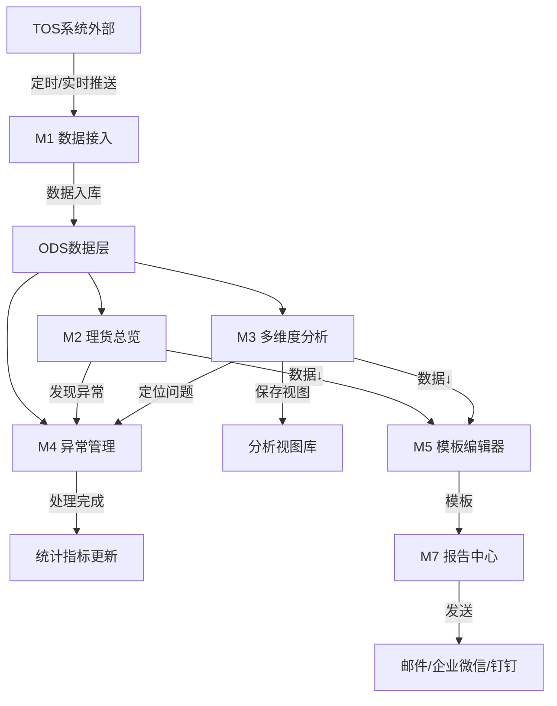
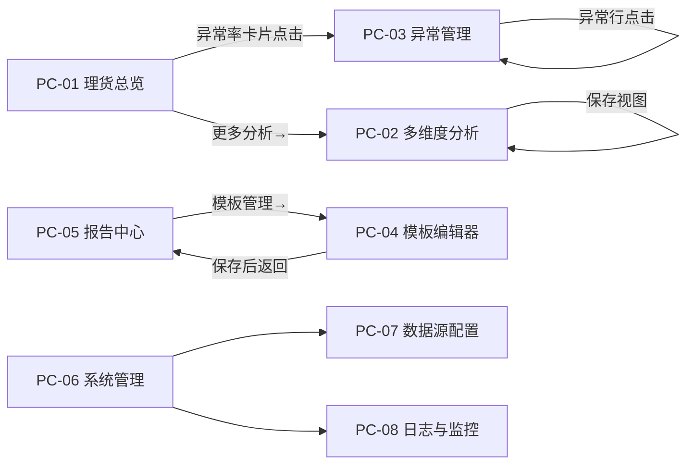

# 《港口集装箱理货数据分析平台》产品需求规格说明书

> 版本号：V1.0
> 生成日期：2026-07-03
> 文档状态：初稿
> 确认人：___________

---

## 第1章 产品概述

### 1.1 产品定位

港口集装箱理货数据分析平台是一款面向**理货公司/第三方理货服务商**的纯数据分析产品。

**核心定位**：本平台是**数据分析层**，而非理货作业系统。所有原始数据均来自外部 TOS（码头操作系统），平台专注于数据的汇聚、分析、展示与报告输出。不包含 OCR 识别、AI 视觉、硬件集成等理货作业功能。

**价值主张**：
- 统一视图：跨码头、跨TOS系统的理货数据统一汇聚分析
- 效率洞察：从效率、准确率、异常率等维度发现瓶颈
- 闭环管理：异常事件从发现到处理的状态流转与追踪
- 灵活报告：拖拽式模板编辑器 + 定时发送，降低报告制作成本

### 1.2 目标用户画像

| 角色 | 职责 | 痛点 | 使用频率 | 关注点 |
|------|------|------|:---:|------|
| 理货主管 | 管理理货团队，监控日常作业 | 多码头数据分散，无法快速全局掌握 | 每日多次 | 总览KPI、异常告警、效率对比 |
| 理货员 | 执行具体理货任务 | 需要快速定位自己负责的船舶/箱量数据 | 每班次 | 任务进度、箱量统计 |
| 运营经理 | 制定运营策略，考核绩效 | 缺乏跨码头效率对比和趋势分析 | 每日1次 | 效率趋势、码头对比、多维分析 |
| 数据分析师 | 深度分析理货数据 | 需要灵活的多维下钻分析能力 | 按需 | 多维透视、自定义分析视图 |
| 系统管理员 | 维护系统配置和用户权限 | 需要统一管理多TOS对接和用户权限 | 按需 | 用户/角色/权限、数据源状态 |

### 1.3 核心使用场景

| 场景 | 用户 | 描述 |
|------|------|------|
| 晨会总览 | 理货主管 | 每天8:30打开理货总览页，快速浏览昨日KPI、异常事件、在港船舶，形成早会汇报要点 |
| 效率瓶颈定位 | 运营经理 | 通过多维度分析页，交叉比对航线×码头×班次的理货效率，发现瓶颈环节 |
| 异常事件处理 | 理货主管/理货员 | 从异常管理页认领事件，查看数据快照，流转处理状态直至关闭 |
| 报告制作与发送 | 运营经理 | 通过模板编辑器拖拽组件设计报告，设置定时发送，自动推送给相关方 |
| 系统运维监控 | 系统管理员 | 巡检系统健康面板，检查TOS同步状态，查看操作审计日志 |

### 1.4 核心名词与术语

| 术语 | 英文/缩写 | 定义 |
|------|----------|------|
| 理货 | Tally | 对进出港集装箱进行计数、验残、核对封条、记录箱号等操作 |
| TEU | Twenty-foot Equivalent Unit | 20英尺标准箱，集装箱计量单位 |
| TOS | Terminal Operating System | 码头操作系统，理货数据的上游来源系统 |
| 岸桥 | Quay Crane / QC | 码头岸边用于装卸集装箱的大型起重机 |
| 航线 | Route / Service | 船舶的运输路线，如东南亚航线、欧洲航线 |
| 箱主 | Container Owner | 集装箱的所有者/租赁方，如COSCO、MSC |
| 箱型 | Container Type | 集装箱规格，如20GP、40GP、40HC |
| 航次 | Voyage | 船舶一次航行任务的编号 |
| 识别准确率 | Recognition Accuracy | TOS 系统对箱号/箱型/箱门朝向等自动识别的准确率 |
| 热力色阶 | Heatmap Color Scale | 透视表中以颜色深浅表示数值大小的可视化方式 |

### 1.5 约束与依赖

| 约束类型 | 内容 |
|---------|------|
| 部署方式 | 私有化部署，支持信创环境 |
| 数据依赖 | 所有数据来自外部 TOS 系统（平方科技/哪吒科技/天津随行等），本平台不产生原始理货数据 |
| 接入协议 | HTTP API / WebSocket，支持多TOS同时对接 |
| 浏览器 | Chrome 90+ / Edge 90+（推荐），兼容 Firefox |
| 网络 | 需与码头TOS系统网络互通，延迟 < 50ms |
| 用户规模 | 预计 50-200 用户并发 |
| AI依赖 | 无。本平台不做 AI 识别/预测，仅做数据统计分析 |

---

## 第2章 功能需求总览

### 2.1 功能基准矩阵

基于竞品调研（详见`01-调研与资料/竞品调研报告.md`），调研覆盖 8家直接竞品 + 3家港口解决方案商 + 4家国际产品 + 6家跨行业标杆。核心发现：**竞品均为"理货作业系统"，无"理货数据分析平台"**。

| 功能模块 | 平方科技 | 哪吒科技 | 天津随行 | 本平台决策 |
|---------|:---:|:---:|:---:|:---:|
| 理货数据采集/OCR | ✅ | ✅ | ✅ | ❌ 不涉及（TOS提供） |
| 实时理货监控 | ✅ | ✅ | ✅ | ❌ 不涉及（TOS提供） |
| 数据分析总览 | ⬜ | ⬜ | ⬜ | ✅ **新增核心** |
| 多维度分析/下钻 | ⬜ | ⬜ | ⬜ | ✅ **新增核心** |
| 异常管理闭环 | 部分 | 部分 | ⬜ | ✅ **增强** |
| 报告模板编辑 | 部分 | ⬜ | ⬜ | ✅ **增强** |
| 定时报告发送 | 部分 | ⬜ | ⬜ | ✅ **增强** |
| 跨码头对比 | ⬜ | ⬜ | ⬜ | ✅ **新增差异化** |
| 系统管理/权限 | ✅ | ✅ | ✅ | ✅ 保留 |
| 操作审计日志 | ✅ | ✅ | ⬜ | ✅ 保留 |

### 2.2 模块决策表

| 模块ID | 模块名称 | 决策 | 理由 |
|:---:|------|:---:|------|
| M1 | 数据接入 | 保留+增强 | 多TOS对接、数据表映射、同步监控是平台基础能力 |
| M2 | 理货总览 | **新增** | 竞品无，本平台核心差异化模块——跨码头统一总览 |
| M3 | 多维度分析 | **新增** | 竞品无，本平台核心差异化模块——灵活多维下钻 |
| M4 | 异常管理 | 增强 | 竞品有基础，本平台增强为闭环流转+数据快照 |
| M5 | 模板编辑器 | 增强 | 竞品有基础模板，本平台增强为可视化拖拽编辑 |
| M6 | 客户数据门户 | **删除** | 用户明确不需要对外客户门户 |
| M7 | 报告中心 | 保留+增强 | 竞品有基础，本平台增强定时发送+多格式导出 |
| M8 | 系统管理 | 保留 | 基础配置能力，各竞品均具备 |
| M9 | 日志与监控 | 保留 | 审计+运维能力，增强健康监控面板 |

### 2.3 功能清单详版

**M1 数据接入**
| 功能点 | 描述 | 优先级 |
|--------|------|:---:|
| TOS对接管理 | 新增/编辑/删除TOS系统对接配置，支持HTTP API和WebSocket协议 | P0 |
| 连接测试 | 向TOS发送测试请求，验证连通性和数据版本 | P0 |
| 数据表映射 | TOS源表→平台目标表的字段映射配置，支持默认值和转换规则 | P0 |
| 同步调度 | 全量/增量/手动三种同步方式，支持自定义间隔 | P0 |
| 同步日志 | 记录每次同步的时间/来源/表名/行数/状态/耗时 | P1 |

**M2 理货总览**
| 功能点 | 描述 | 优先级 |
|--------|------|:---:|
| 核心KPI卡片 | 累计箱量/日均箱量/理货效率/识别准确率/异常率/在港船舶 | P0 |
| 箱量与效率趋势 | 支持日/周/月切换，柱状+折线组合图 | P0 |
| 在港船舶进度 | 当前在港各船理货完成进度条 | P0 |
| 航线箱量分布 | 桑基图展示航线→码头流向 | P1 |
| 箱主/货种占比 | 环形图+排行列表 | P1 |
| 效率热力图 | 岸桥×小时 效率矩阵热力图 | P1 |
| 码头对比 | 各码头关键指标分组柱状图对比 | P1 |
| 近期异常事件 | 最近10条异常事件摘要列表 | P0 |
| 船舶周转时间 | 各航线周转时间趋势折线图 | P1 |
| 班次效率对比 | 各班组效率雷达图对比 | P1 |

**M3 多维度分析**
| 功能点 | 描述 | 优先级 |
|--------|------|:---:|
| 维度选择器 | 行维/列维/筛选维 三级下拉 + 拖拽交换 | P0 |
| 指标多选 | 箱量/效率/准确率/异常率/周转时间 Checkbox | P0 |
| 交叉透视表 | 行列交叉数据表，热力色阶，行列合计，同比△% | P0 |
| 下钻图表 | 柱状/折线/堆叠三种图表切换，配合透视表联动 | P0 |
| 雷达图对比 | 多码头/多航线效率六维雷达对比 | P1 |
| 数据明细抽屉 | 点击透视表单元格→抽屉展开明细列表+导出 | P1 |
| 效率趋势Sparkline | 各航线近6月效率走势迷你图 | P1 |
| 保存分析视图 | 命名保存当前维度+指标组合，快速切换 | P2 |

**M4 异常管理**
| 功能点 | 描述 | 优先级 |
|--------|------|:---:|
| 全局筛选器 | 时间范围/异常类型/严重等级/处理状态/码头/航线 | P0 |
| 异常概览统计 | 待处理/处理中/已关闭/平均处理时长/本周新增 卡片 | P0 |
| 异常趋势图 | 按类型堆叠面积图，近30天 | P1 |
| 异常事件列表 | 异常ID/类型/等级/描述/来源/时间/状态/处理人 表格 | P0 |
| 异常详情抽屉 | 基本信息+数据快照+处理时间线+操作按钮 | P0 |
| 状态流转 | 待处理→[认领]→处理中→[关闭]→已关闭 | P0 |
| 批量操作 | 批量认领/关闭，关闭需填写原因 | P1 |

**M5 模板编辑器**
| 功能点 | 描述 | 优先级 |
|--------|------|:---:|
| 组件库 | 图表卡片/文本块(Markdown)/图片/表格/KPI卡/分隔线/地图 | P0 |
| 拖拽画布 | react-grid-layout 12列网格，自由拖拽+调整尺寸 | P0 |
| 属性面板 | 按选中组件显示对应配置项(标题/数据源/尺寸/样式) | P0 |
| 编辑/预览切换 | isPreview状态切换，预览时隐藏所有编辑UI+加载真实数据 | P0 |
| 撤销/重做 | 操作历史栈(50步), Ctrl+Z/Y | P1 |
| 导出 | PDF/图片格式导出 | P1 |

**M7 报告中心**
| 功能点 | 描述 | 优先级 |
|--------|------|:---:|
| 报告列表 | 报告名称/类型/模板/时间/状态/接收人/操作 表格 | P0 |
| 生成报告 | 弹窗: 选模板/时间范围/数据范围/输出格式 | P0 |
| 下载/发送 | [下载]直接下载 / [发送]弹窗选接收人和发送方式 | P0 |
| 定时任务 | 配置Cron/模板/接收人，自动执行 | P1 |
| 报告预览 | 生成前预览报告效果 | P2 |

**M8 系统管理**
| 功能点 | 描述 | 优先级 |
|--------|------|:---:|
| 用户管理 | 新增/编辑/停用/删除/重置密码 | P0 |
| 角色管理 | 定义角色+关联权限矩阵 | P0 |
| 权限矩阵 | 角色×模块 读/写权限勾选 | P0 |
| 码头配置 | 码头名称/编码/时区/TOS对接标识 | P1 |
| 系统参数 | 如: 日志保留天数/同步超时阈值/告警阈值等 | P2 |

**M9 日志与监控**
| 功能点 | 描述 | 优先级 |
|--------|------|:---:|
| 操作日志 | 时间/操作人/类型/模块/详情/IP/结果 列表 | P0 |
| 日志筛选 | 按操作人/类型/模块/时间组合筛选 | P0 |
| 日志导出 | 筛选结果导出 Excel/CSV | P1 |
| 系统健康面板 | API网关/数据库/同步引擎/消息队列/缓存 5项心跳 | P1 |
| 告警规则 | 同步失败/连接断开/响应超时/错误率/磁盘/CPU 阈值配置 | P2 |

### 2.4 用户角色与权限矩阵

| 模块 | 理货主管 | 理货员 | 运营经理 | 数据分析师 | 系统管理员 |
|------|:---:|:---:|:---:|:---:|:---:|
| M2 理货总览 | 读 | 读 | 读 | 读 | 读 |
| M3 多维度分析 | 读 | — | 读 | 读/写 | 读 |
| M4 异常管理 | 读/写 | 读/写 | 读 | 读 | 读 |
| M5 模板编辑器 | 读/写 | — | 读/写 | 读 | 读 |
| M7 报告中心 | 读/写 | 读 | 读/写 | 读 | 读 |
| M8 系统管理 | — | — | — | — | 读/写 |
| M1 数据源配置 | — | — | — | — | 读/写 |
| M9 日志与监控 | — | — | — | — | 读/写 |

---

## 第3章 功能架构设计

### 3.1 功能模块结构图

```
港口集装箱理货数据分析平台
│
├─ M1 数据接入 ───────────────────────────── 数据基础层
│   ├─ TOS对接管理
│   ├─ 数据表映射
│   ├─ 同步调度引擎
│   └─ 同步日志
│
├─ M2 理货总览 ───────────────────────────── 应用层·总览
│   ├─ KPI概览
│   ├─ 趋势分析
│   ├─ 在港进度
│   ├─ 分布分析
│   └─ 对比分析
│
├─ M3 多维度分析 ─────────────────────────── 应用层·分析
│   ├─ 维度选择
│   ├─ 交叉透视表
│   ├─ 下钻图表
│   └─ 分析视图管理
│
├─ M4 异常管理 ───────────────────────────── 应用层·管理
│   ├─ 异常筛选
│   ├─ 事件列表
│   ├─ 详情与处理
│   └─ 批量操作
│
├─ M5 模板编辑器 ─────────────────────────── 增值层·工具
│   ├─ 组件库
│   ├─ 拖拽画布
│   └─ 属性面板
│
├─ M7 报告中心 ───────────────────────────── 增值层·输出
│   ├─ 报告管理
│   ├─ 报告生成
│   └─ 定时发送
│
├─ M8 系统管理 ───────────────────────────── 支撑层·配置
│   ├─ 用户与角色
│   ├─ 权限矩阵
│   └─ 码头配置
│
└─ M9 日志与监控 ─────────────────────────── 支撑层·运维
    ├─ 操作审计
    ├─ 系统健康
    └─ 告警规则
```

### 3.2 模块定位与分工说明

| 层级 | 模块 | 定位说明 |
|------|------|---------|
| 基础层 | M1 | 所有数据的入口，对接多个 TOS 系统，完成数据采集→清洗→入库 |
| 应用层 | M2+M3+M4 | 用户日常操作核心，覆盖"看总览→分析下钻→管理异常"主工作流 |
| 增值层 | M5+M7 | 报告制作与输出能力，提升分析成果的转化和分发效率 |
| 支撑层 | M8+M9 | 系统正常运行的基础保障，非业务模块但对运维至关重要 |

### 3.3 模块业务依赖关系

```
M1(数据接入) ──数据──→ M2(总览)
  │                    │
  ├──数据──→ M3(多维分析)
  │                    │
  └──数据──→ M4(异常管理)
                       │
              M5(模板编辑器) ←──模板引用── M7(报告中心)
                       │                    │
                       └──读取数据──────────┘
                                    │
              M8(系统管理) ←──权限控制──→ 全模块
              M9(日志监控) ←──审计记录──→ 全模块
```

---

## 第4章 系统核心业务流程

### 4.1 核心业务流程总览



### 4.2 关键业务节点说明

| 节点 | 说明 |
|------|------|
| 数据入库 | TOS数据经M1同步→ODS层标准化，5min/实时两种间隔 |
| 异常发现 | 两种路径：① M2总览中异常率卡点击进入M4；② M3分析中发现异常值跳转M4 |
| 异常处理闭环 | M4中 待处理→认领→处理→关闭，每次流转记录时间线和操作人 |
| 报告生成链 | 选模板(M5产出)→选时间范围+数据范围→生成(M7)→下载或发送 |
| 权限校验 | M8权限矩阵在每个模块入口校验→无权限返回403+提示 |

### 4.3 系统间数据流转

```
外部TOS系统(平方科技/哪吒/天津随行)
    │
    │ HTTP API / WebSocket
    ▼
M1 数据接入层
    ├─ 数据接收 → 格式校验 → 数据清洗
    ├─ 字段映射(TOS源表→平台目标表)
    └─ 写入 ODS 层数据库
        │
        ▼
平台内部数据层(ODS → 分析库)
    │
    ├──→ M2/M3/M4 查询读取(只读)
    └──→ M5/M7 引用数据(只读)
```

---

## 第5章 用户体验与页面结构设计

### 5.1 核心用户故事链

| 故事ID | 用户 | 故事 | 涉及页面 |
|:---:|------|------|---------|
| US-01 | 理货主管 | 早班打开总览→查看KPI→发现异常率偏高→点击跳转异常管理→分配处理→处理后关闭 | PC-01 → PC-03 |
| US-02 | 运营经理 | 打开多维分析→选择航线×码头×月维度→发现码头C效率低→下钻明细→导出数据 | PC-02 |
| US-03 | 运营经理 | 打开模板编辑器→拖拽KPI卡+趋势图+文本块→切换预览→确认效果→保存模板→去报告中心生成发送 | PC-04 → PC-05 |
| US-04 | 系统管理员 | 巡检健康面板→发现TOS同步异常→查看同步日志→测试连接→恢复正常 | PC-07 → PC-08 |
| US-05 | 数据分析师 | 多维分析→保存3个分析视图→在视图间快速切换→发现季节性规律→导出分析结果 | PC-02 |

### 5.2 一级导航结构

```
📊 总览看板        → PC-01 理货总览
📈 数据分析        → PC-02 多维度分析
⚠ 异常中心        → PC-03 异常管理
📄 模板与报告
    ├─ 模板编辑器  → PC-04 模板编辑器
    └─ 报告中心    → PC-05 报告中心
⚙ 系统设置
    ├─ 系统管理    → PC-06 系统管理
    ├─ 数据源配置  → PC-07 数据源配置
    └─ 日志与监控  → PC-08 操作日志与监控
```

### 5.3 页面跳转关系



| 跳转路径 | 触发方式 | 说明 |
|---------|---------|------|
| PC-01 → PC-03 | 异常率KPI卡片点击 | 携带筛选条件：当前码头+当天 |
| PC-01 → PC-02 | "更多分析→"链接 | 从总览进入深度分析 |
| PC-05 → PC-04 | "模板管理→"按钮 | 编辑已有模板或新建 |
| PC-04 → PC-05 | 保存模板后 | 返回报告中心选择模板生成 |

### 5.4 页面清单

详见 `02-产品设计/页面清单.yaml`。共 8 页，覆盖 8 个功能模块。

---

## 第6章 页面详细设计

### 6.1 M2-理货总览 — 功能概述

首页总览看板，为用户提供跨码头理货数据的全局视角。包含KPI卡片、趋势图表、在港进度、分布分析和效率对比五大区域。

---

#### 6.1.1 PC-01：理货总览

**页面路径**：侧边菜单 > 📊 总览看板

**线框图**：`02-产品设计/线框图/PC-01-理货总览.excalidraw`（布局参见线框图）

**页面元素说明**：
| 区域 | 元素 | 类型 | 说明 |
|------|------|------|------|
| 全局筛选器 | 码头/航线/时间范围选择 | Select + DatePicker | 5个筛选器 + 3个时间快捷按钮(今日/本周/本月) |
| 核心KPI区 | 6个指标卡片 | StatCard | 累计箱量/日均箱量/理货效率/识别准确率/异常率/在港船舶，含同比箭头 |
| 箱量与效率趋势 | Tab切换图表 | ChartCard | 日/周/月 Tab + 柱状+折线组合图 + Top10排行侧栏 |
| 在港船舶进度 | 4张船舶卡片 | Card + Progress | 船名/航次/进度条/预计完成时间 + "还有14艘"链接 |
| 航线箱量分布 | 桑基图 | ChartCard | 航线→码头流向分布 |
| 箱主/货种占比 | 环形图+排行 | ChartCard | 环形图 + 横向排行柱状 |
| 效率热力图 | 矩阵热力图 | ChartCard | 小时×岸桥 效率色阶矩阵 |
| 码头对比 | 分组柱状图 | ChartCard | 各码头关键指标对比 |
| 异常事件 | 4行摘要表格 | Table | 异常ID/类型/等级/描述/时间 |
| 船舶周转 | 折线+柱状组合 | ChartCard | 各航线周转时间趋势 |
| 班次效率 | 雷达图 | ChartCard | 各班次效率六维雷达对比 |

**交互行为**（从线框图标注提取）：
| 触发动作 | 前置条件 | 系统响应 | 反馈方式 |
|---------|---------|---------|---------|
| 筛选器值变更 | — | 全局数据刷新（防抖300ms） | Loading → 数据更新 |
| KPI卡片点击（异常率） | — | 跳转至 PC-03 异常管理 | 页面跳转 |
| 在港船舶→"还有N艘"链接点击 | 在港船舶 > 4艘 | 展开完整列表 | 弹窗展示 |
| 图表Tab切换 | — | 对应图表重新渲染 | 图表动画切换 |
| 效率热力图单元格悬停 | — | Tooltip显示 岸桥/时间/效率值 | 浮层 |

**异常处理**（从线框图标注提取）：
| 场景 | 系统行为 | 用户提示 |
|------|---------|---------|
| 数据加载中 | 骨架屏占位 | — |
| 筛选后无数据 | 显示空状态图 | "当前条件暂无数据，请调整筛选条件" |
| TOS数据断流 | KPI卡片数据标红+顶部告警条 | "数据上次更新于XX分钟前" |
| 图表渲染失败 | 图表区显示错误占位 | "图表加载失败" + 重试按钮 |

**关联弹窗/子页面**：
| 序号 | 弹窗名称 | 触发入口 | 宽度 | 内容概要 |
|:----:|---------|---------|:---:|---------|
| M01 | 在港船舶完整列表 | "还有N艘"链接 | 800px | 全部在港船舶表格（船名/航次/码头/计划箱量/已完成/进度/预计完成） |

---

### 6.2 M3-多维度分析 — 功能概述

交互式多维数据分析页，用户可自由选择维度组合、切换指标，通过透视表和图表联动下钻。支持保存分析视图。

---

#### 6.2.1 PC-02：多维度分析

**页面路径**：侧边菜单 > 📈 数据分析

**线框图**：`02-产品设计/线框图/PC-02-多维度分析.excalidraw`（布局参见线框图）

**页面元素说明**：
| 区域 | 元素 | 类型 | 说明 |
|------|------|------|------|
| 维度选择区 | 行/列/筛选维度+时间粒度 | Select × 4 | 支持拖拽交换行列，蓝色背景区 |
| 指标选择区 | 5个指标Checkbox | Checkbox | 箱量/理货效率/识别准确率/异常率/周转时间，黄色背景区 |
| 交叉透视表 | 行列交叉数据表格 | PivotTable | 8航线×5码头，热力色阶，含行列合计+同比△% |
| 下钻图表 | 堆叠柱状图 | ChartCard | Tab切换[柱状]/[折线]/[堆叠]，数据联动透视表 |
| 雷达图对比 | 六维雷达图 | ChartCard | 箱量/效率/准确率/时效/服务/安全，3组码头对比 |
| 趋势Sparkline | 8个迷你折线图 | Sparkline | 各航线近6月效率走势+终点数值+涨跌箭头 |
| 明细抽屉 | 数据明细列表 | Drawer | 触发于单元格点击，640px宽，含分页+导出 |

**交互行为**（从线框图标注提取）：
| 触发动作 | 前置条件 | 系统响应 | 反馈方式 |
|---------|---------|---------|---------|
| 维度下拉选择/拖拽 | — | 透视表+图表+雷达+趋势全部刷新（防抖300ms） | 骨架屏→数据更新 |
| 透视表单元格点击 | 单元格有数据 | 右侧抽屉滑入，展示该维度组合明细列表 | 抽屉动画 |
| 图表类型Tab切换 | — | 仅❹区图表重绘，透视表不变 | 图表动画切换 |
| 条件格式单元格悬停 | — | Tooltip浮层：维度值/指标值/同比%/环比/排名/占比 | 浮层 |
| 保存分析视图 | 维度+指标已配置 | 弹窗命名保存 | 维度区新增已保存视图快捷入口 |
| 导出当前分析 | — | 弹窗选择格式和范围 → 下载 | 文件下载 |

**异常处理**（从线框图标注提取）：
| 场景 | 系统行为 | 用户提示 |
|------|---------|---------|
| 维度组合无数据 | 透视表区空状态 | "当前维度组合暂无数据，请调整维度或扩大时间范围" + 重置按钮 |
| 维度组合>10,000单元格 | Toast警告 | "当前维度组合将产生N个单元格，可能影响性能" + 粗粒度建议 |
| 数据源超时 | 全区域遮罩 | "数据加载失败，请稍后重试" + 重试/切换离线缓存按钮 |

**关联弹窗/子页面**：
| 序号 | 弹窗名称 | 触发入口 | 宽度 | 内容概要 |
|:----:|---------|---------|:---:|---------|
| M01 | 保存分析视图 | 保存按钮 | 480px | 视图名称输入 + 确认/取消 |
| M02 | 导出配置 | 导出按钮 | 520px | 格式选择(Excel/CSV/图片) + 范围(当前页/全部) |

---

### 6.3 M4-异常管理 — 功能概述

集中管理所有理货异常事件，覆盖从发现到关闭的完整闭环。支持筛选、批量操作和详情查看。

---

#### 6.3.1 PC-03：异常管理

**页面路径**：侧边菜单 > ⚠ 异常中心

**线框图**：`02-产品设计/线框图/PC-03-异常管理.excalidraw`（布局参见线框图）

**页面元素说明**：
| 区域 | 元素 | 类型 | 说明 |
|------|------|------|------|
| 全局筛选器 | 时间/类型/等级/状态/码头/航线 | Select × 6 | 含保存筛选方案按钮 |
| 异常概览统计 | 5个统计卡片 | StatCard | 待处理/处理中/已关闭/平均处理时长/本周新增，可点击联动列表 |
| 异常趋势图 | 堆叠面积图 | ChartCard | 近30天 严重/警告/提示 三色堆叠 |
| 异常分布 | 环形图 | ChartCard | Tab切换[按类型]/[按码头] |
| 事件列表 | 数据表格 | Table | 异常ID/类型/等级/描述/来源/时间/状态/处理人/操作 |
| 批量操作栏 | 按钮组 | ActionBar | 已选N条 + 批量认领 + 批量关闭 |
| 详情抽屉 | 详情+时间线 | Drawer | 640px宽，基本信息+数据快照+处理记录+操作按钮 |

**交互行为**（从线框图标注提取）：
| 触发动作 | 前置条件 | 系统响应 | 反馈方式 |
|---------|---------|---------|---------|
| 统计卡片点击 | — | 列表自动筛选对应状态 | 筛选器值更新+列表刷新 |
| 列表行点击 | — | 右侧抽屉滑出（640px） | 抽屉动画 |
| [认领] → [关闭] | 待处理→认领→处理中→填写原因→关闭 | 状态流转 + 时间线追加 + 列表刷新 | Toast"处理完成" |
| 批量关闭 | 勾选≥1条 | 弹窗确认→填写关闭原因→批量更新 | 结果通知 |

**异常处理**（从线框图标注提取）：
| 场景 | 系统行为 | 用户提示 |
|------|---------|---------|
| 筛选无匹配 | 列表区空状态 | "当前筛选条件下无异常记录" + 扩大时间范围/重置建议 |
| 他人已处理该异常 | 操作拦截 | "该异常已被XX处理，状态已更新" + 刷新 |
| 批量关闭确认 | 二次确认弹窗 | "确认关闭选中的N条异常? 请填写关闭原因(必填)" |

**关联弹窗/子页面**：
| 序号 | 弹窗名称 | 触发入口 | 宽度 | 内容概要 |
|:----:|---------|---------|:---:|---------|
| M01 | 批量关闭确认 | 批量关闭按钮 | 520px | 关闭原因(必填) + 备注(可选) + 确认/取消 |
| M02 | 保存筛选方案 | 筛选器区保存按钮 | 480px | 方案命名 + 确认/取消 |

---

### 6.4 M5-模板编辑器 — 功能概述

拖拽式可视化报告模板编辑器。左侧组件库，中央12列网格画布，右侧属性面板。编辑/预览双模式。

---

#### 6.4.1 PC-04：模板编辑器

**页面路径**：侧边菜单 > 📄 模板与报告 > 模板编辑器

**线框图**：`02-产品设计/线框图/PC-04-模板编辑器.excalidraw`（布局参见线框图）

**页面元素说明**：
| 区域 | 元素 | 类型 | 说明 |
|------|------|------|------|
| 顶部工具栏 | 模板名称/保存/撤销/重做/切换模式 | Input + Button | 固定顶部，编辑/预览模式切换按钮突出 |
| 组件库(左) | 7种可拖拽组件 | DragList | 图表卡片/文本块(Markdown)/图片/表格/KPI卡/分隔线/地图 |
| 编辑画布(中) | 12列网格拖拽区 | react-grid-layout | 已拖入组件卡片, 可排序/调整尺寸, 图表区仅标注占位 |
| 属性面板(右) | 上下文相关配置 | Form | 选中组件后显示: 标题/数据源/图表类型/尺寸等 |

**交互行为**（从线框图标注提取）：
| 触发动作 | 前置条件 | 系统响应 | 反馈方式 |
|---------|---------|---------|---------|
| 组件从库拖入画布 | — | 画布显示蓝色放置预览线→添加至网格 | 属性面板自动切换 |
| 画布内拖拽交换 | 组件≥2个 | react-grid-layout重排 | 实时位置更新 |
| 属性面板修改 | 组件已选中 | 画布中组件实时更新预览 | 即时响应 |
| 编辑/预览切换 | — | isPreview切换→编辑UI隐藏→真实数据渲染 | 全页面切换 |
| 切换模式前未保存 | 有未保存变更 | 弹窗确认："保存后预览? / 不保存 / 取消" | 弹窗阻塞 |

**异常处理**（从线框图标注提取）：
| 场景 | 系统行为 | 用户提示 |
|------|---------|---------|
| 数据源失效 | 组件左上角红色三角 + Tooltip | "数据源不可用" + 属性面板数据源字段标红 |
| 画布为空 | 中央引导文字+箭头动画 | "从左侧组件库拖拽组件至此开始设计模板" |
| 导出失败 | Notification | "导出失败: {原因}" + 重试/下载JSON备选 |

**关联弹窗/子页面**：
| 序号 | 弹窗名称 | 触发入口 | 宽度 | 内容概要 |
|:----:|---------|---------|:---:|---------|
| M01 | 未保存确认 | 切换预览/退出 | 440px | "模板有未保存更改" → 保存并继续/不保存/取消 |
| M02 | 导出格式选择 | 导出按钮 | 480px | PDF/PNG格式 + 页面尺寸选择 |
| M03 | 数据源选择器 | 属性面板数据源字段 | 560px | 数据源列表/预览/搜索 |

---

### 6.5 M7-报告中心 — 功能概述

报告生成、管理和分发的统一页面。支持基于模板生成报告、直接下载或发送、配置定时发送任务。

---

#### 6.5.1 PC-05：报告中心

**页面路径**：侧边菜单 > 📄 模板与报告 > 报告中心

**线框图**：`02-产品设计/线框图/PC-05-报告中心.excalidraw`（布局参见线框图）

**页面元素说明**：
| 区域 | 元素 | 类型 | 说明 |
|------|------|------|------|
| 筛选器&操作栏 | 报告类型/时间/状态筛选 + 生成/模板管理按钮 | Select + Button | 顶部横栏 |
| 报告概览 | 5个统计卡片 | StatCard | 本月生成/已发送/生成中/失败/定时任务数 |
| 报告列表 | 数据表格 | Table | 报告名称/类型/模板/生成时间/状态/接收人/操作 |
| 定时任务表 | 定时任务列表 | Table | 任务名/Cron/模板/接收人/启用状态 |

**交互行为**（从线框图标注提取）：
| 触发动作 | 前置条件 | 系统响应 | 反馈方式 |
|---------|---------|---------|---------|
| [生成报告] 点击 | — | 弹窗: 选模板/时间范围/数据范围/格式→确认→列表新增(生成中)→完成自动刷新 | 弹窗→列表更新 |
| [发送] 点击 | 报告状态=已生成 | 弹窗: 接收人(多选)/方式(邮件/企微/钉钉)/附言→确认发送 | 发送成功Toast |
| [模板管理→] 点击 | — | 跳转 PC-04 模板编辑器 | 页面跳转 |
| 定时任务新增 | — | 弹窗配置 Cron/模板/接收人 → 保存 | 定时任务表新增行 |

**异常处理**（从线框图标注提取）：
| 场景 | 系统行为 | 用户提示 |
|------|---------|---------|
| 报告生成失败 | 行状态标红 + 失败原因Tooltip | 重试/查看日志/手动生成按钮 |
| 列表为空 | 空状态引导 | "暂无报告记录" + 引导生成第一份报告 |
| 下载失败 | Notification | "下载失败，请重试" + 切换格式备选 |

**关联弹窗/子页面**：
| 序号 | 弹窗名称 | 触发入口 | 宽度 | 内容概要 |
|:----:|---------|---------|:---:|---------|
| M01 | 生成报告 | [生成报告] 按钮 | 560px | 选择模板/时间范围/数据范围/格式 |
| M02 | 发送配置 | [发送] 链接 | 520px | 选择接收人/发送方式/附言 |
| M03 | 定时任务配置 | [新增定时任务] | 520px | 任务名/Cron表达式/模板/接收人/启用开关 |

---

### 6.6 M8-系统管理 — 功能概述

系统级配置管理，包括用户、角色、权限矩阵和码头信息的管理。

---

#### 6.6.1 PC-06：系统管理

**页面路径**：侧边菜单 > ⚙ 系统设置 > 系统管理

**线框图**：`02-产品设计/线框图/PC-06-系统管理.excalidraw`（布局参见线框图）

**页面元素说明**：
| 区域 | 元素 | 类型 | 说明 |
|------|------|------|------|
| Tab切换 | 用户管理/角色管理/码头配置/系统参数 | Tabs | 4个Tab各自独立加载 |
| 用户列表 | 数据表格 | Table | 姓名/用户名/角色/所属码头/状态/最后登录/操作 |
| 角色权限矩阵 | 权限勾选表 | Table | 角色×模块 读/写权限, 点击✅切换 |
| 码头配置表 | 码头信息表格 | Table | 名称/编码/时区/TOS对接/状态/操作 |

**交互行为**（从线框图标注提取）：
| 触发动作 | 前置条件 | 系统响应 | 反馈方式 |
|---------|---------|---------|---------|
| 新增/编辑用户 | — | 弹窗表单: 用户名/姓名/密码/角色/码头/状态 | 列表刷新 |
| 权限单元格点击 | — | 切换✅⬜ → 底部出现保存按钮 | 即时UI变化 |
| Tab切换(有未保存) | 权限修改未保存 | 确认弹窗: "保存后离开?/放弃更改/取消" | 弹窗阻塞 |
| 重置密码 | 选中用户 | 弹窗: 新密码+确认 → 保存 | "密码已重置"Toast |

**异常处理**（从线框图标注提取）：
| 场景 | 系统行为 | 用户提示 |
|------|---------|---------|
| 删除用户 | 二次确认弹窗 | "该用户拥有N条操作记录，删除后保留审计日志" + 软删除建议 |
| 权限未保存切换Tab | 确认弹窗 | "权限配置有未保存的更改" → 保存后离开/放弃更改/取消 |

**关联弹窗/子页面**：
| 序号 | 弹窗名称 | 触发入口 | 宽度 | 内容概要 |
|:----:|---------|---------|:---:|---------|
| M01 | 新增/编辑用户 | +新增用户 / 编辑 | 520px | 用户名/姓名/密码/角色/码头/状态 |
| M02 | 重置密码 | 表格操作列 | 400px | 新密码 + 确认密码 |

---

### 6.7 M1-数据接入 — 功能概述

管理平台与外部TOS系统的数据对接，包括对接配置、数据表映射和同步监控。

---

#### 6.7.1 PC-07：数据源配置

**页面路径**：侧边菜单 > ⚙ 系统设置 > 数据源配置

**线框图**：`02-产品设计/线框图/PC-07-数据源配置.excalidraw`（布局参见线框图）

**页面元素说明**：
| 区域 | 元素 | 类型 | 说明 |
|------|------|------|------|
| Tab切换 | TOS对接/数据表映射/同步日志 | Tabs | 3个Tab |
| TOS对接列表 | 系统列表 | Table | 系统名称/编码/所属码头/协议/状态/最近同步/间隔/操作 |
| 数据表映射 | 映射关系表 | Table | TOS源表/平台目标表/映射字段数/状态/操作 |
| 同步日志 | 同步记录列表 | Table | 同步时间/来源系统/数据表/同步行数/状态/耗时 |

**交互行为**（从线框图标注提取）：
| 触发动作 | 前置条件 | 系统响应 | 反馈方式 |
|---------|---------|---------|---------|
| [测试连接] | 对接已配置 | 发送测试请求→返回状态/延迟/版本 | 结果通知(成功✓ + 延迟ms / 失败原因) |
| [手动同步] | 对接已连接 | 弹窗选全量/增量/时间范围→开始同步→日志区实时更新进度 | 进度+完成通知 |
| [编辑映射] | 选中映射 | 全屏弹窗: 左TOS源字段/右平台目标字段 → 拖拽连线 | 弹窗内操作 |

**异常处理**（从线框图标注提取）：
| 场景 | 系统行为 | 用户提示 |
|------|---------|---------|
| TOS连接异常 | 状态标红 + 最近同步停滞 + 自动重试(间隔递增1→5→15min) | 系统通知管理员 |
| 字段变更 | 映射表状态标为"字段变更" | "源表新增N个字段/删除M个字段" + 一键同步字段 |
| 删除对接确认 | 二次确认弹窗 | "删除对接将同时删除关联的映射配置和同步历史" + 输入系统名称确认 |

**关联弹窗/子页面**：
| 序号 | 弹窗名称 | 触发入口 | 宽度 | 内容概要 |
|:----:|---------|---------|:---:|---------|
| M01 | 新增/编辑TOS对接 | +新增对接 / 编辑 | 560px | 系统名称/编码/协议/地址/认证配置 |
| M02 | 字段映射编辑器 | 编辑映射 | 全屏 | 左右双栏字段拖拽映射 |
| M03 | 手动同步配置 | 同步按钮 | 480px | 同步方式(全量/增量)/时间范围 |
| M04 | 删除确认 | 删除按钮 | 440px | 二次确认+输入名称 |

---

### 6.8 M9-日志与监控 — 功能概述

操作审计日志查询和系统健康状态监控。保障合规性和运维可见性。

---

#### 6.8.1 PC-08：操作日志与监控

**页面路径**：侧边菜单 > ⚙ 系统设置 > 日志与监控

**线框图**：`02-产品设计/线框图/PC-08-操作日志与监控.excalidraw`（布局参见线框图）

**页面元素说明**：
| 区域 | 元素 | 类型 | 说明 |
|------|------|------|------|
| Tab切换 | 操作日志/系统健康/告警规则 | Tabs | 3个Tab |
| 筛选器 | 操作人/类型/模块/时间 | Select × 4 | 组合筛选+导出按钮 |
| 操作日志表 | 日志数据列表 | Table | 时间/操作人/类型/模块/详情/IP/结果 |
| 系统健康面板 | 5项服务状态卡 | StatCard | API网关/数据库/同步引擎/消息队列/缓存 |
| API统计(占位) | 图+表区域 | Placeholder | API调用趋势图 + 告警规则列表(标注占位) |

**交互行为**（从线框图标注提取）：
| 触发动作 | 前置条件 | 系统响应 | 反馈方式 |
|---------|---------|---------|---------|
| 筛选器组合筛选 | — | 实时查询日志表 | 列表刷新+分页重置 |
| [导出日志] | 有筛选结果 | 导出当前筛选结果为 Excel/CSV | 文件下载 |
| 登录失败≥5次/5min | 自动触发 | 日志标红 + IP临时黑名单(30min) + 通知管理员 | 告警通知 |

**异常处理**（从线框图标注提取）：
| 场景 | 系统行为 | 用户提示 |
|------|---------|---------|
| 查询结果>10,000条 | 截断展示 | "结果过多，仅展示前10,000条" + 缩小范围/导出建议 |
| 查询已归档数据(>180天) | 查询较慢 | "数据已归档，查询可能较慢(预计5-10s)" + 确认/缩小范围 |
| 服务降级 | 健康面板标黄+全局NoticeBar | "系统部分服务降级，数据查询可能变慢" + 自动恢复后消失 |

**关联弹窗/子页面**：无。所有操作在当前页面内完成。

---

## 第7章 非功能需求

### 7.1 性能需求

| 模块 | 需求项 | 指标 |
|------|--------|------|
| PC-01 理货总览 | 页面首次加载 | < 3秒 |
| PC-02 多维度分析 | 透视表维度切换响应 | < 2秒 (防抖300ms) |
| PC-03 异常管理 | 列表翻页响应 | < 1秒 |
| PC-04 模板编辑器 | 预览模式切换 | < 2秒 |
| PC-05 报告中心 | PDF报告生成 | < 30秒 (100页以内) |
| M1 数据接入 | 单次同步吞吐量 | > 10,000 行/秒 |
| 全局 | 并发用户 | 支持 200 并发 |

### 7.2 安全合规需求

| 需求项 | 说明 |
|--------|------|
| 认证方式 | 用户名+密码登录，支持密码复杂度策略 |
| 权限控制 | 基于角色的模块级访问控制（读/写），入口+API双重校验 |
| 审计日志 | 所有增删改操作记录到操作日志（时间/人/类型/详情/IP），保留180天 |
| 数据传输 | TOS对接支持 HTTPS 加密传输 + API Key 认证 |
| 登录保护 | 同一IP 5分钟内失败≥5次 → IP临时黑名单30分钟 |

### 7.3 系统集成需求

| 集成系统 | 协议 | 方向 | 说明 |
|---------|------|:---:|------|
| 平方科技 TOS | HTTP API v2 | 入 | 定时拉取理货数据 |
| 哪吒 TOS | WebSocket | 入 | 实时推送理货数据 |
| 天津随行 TOS | HTTP API v1 | 入 | 定时拉取理货数据 |
| 邮件服务 | SMTP | 出 | 报告发送 |
| 企业微信 | Webhook | 出 | 报告发送 + 告警通知 |
| 钉钉 | Webhook | 出 | 报告发送 + 告警通知 |

### 7.4 可用性与运维需求

| 需求项 | 说明 |
|--------|------|
| 服务可用性 | 99.5% (非关键业务窗口: 允许凌晨2-4点维护) |
| 健康监控 | 5项核心服务30秒心跳检测，异常自动告警 |
| 日志管理 | 操作日志180天热存储+冷归档，系统日志30天轮转 |
| 数据备份 | 每日全量备份，保留7天 |
| 部署方式 | Docker Compose 私有化部署，支持信创环境 |

---

## 第8章 核心业务闭环验证

### 8.1 闭环说明

选取 5 条贯穿多页面的端到端流程进行闭环验证。

### 8.2 闭环详情

| ID | 闭环名称 | 涉及页面 | 操作步骤 | 预期结果 |
|:---:|------|------|---------|---------|
| CL-01 | 晨会总览→异常处理闭环 | PC-01 → PC-03 | ①打开PC-01 ②查看KPI卡片发现异常率↑ ③点击异常率卡片跳转PC-03(携带筛选条件) ④查看异常列表认领事件 ⑤填写处理记录 ⑥关闭事件 | PC-03中该事件状态变为"已关闭"，统计卡数字更新 |
| CL-02 | 效率瓶颈分析闭环 | PC-02 | ①打开PC-02 ②选择行维=航线,列维=码头,指标=理货效率 ③查看透视表热力色阶 ④发现码头C效率偏低 ⑤点击单元格打开明细抽屉 ⑥查看明细列表定位到具体船舶/岸桥 ⑦导出明细数据 | 通过多维下钻定位到具体瓶颈，数据可导出用于汇报 |
| CL-03 | 报告模板→生成→发送闭环 | PC-04 → PC-05 | ①打开PC-04创建新模板 ②拖入KPI卡+趋势图+文本块 ③配置数据源和样式 ④切换预览确认效果 ⑤保存模板 ⑥跳转PC-05 ⑦选模板+时间范围生成报告 ⑧发送给接收人 | 接收人收到邮件/企微报告 |
| CL-04 | TOS对接→数据流入→总览可见闭环 | PC-07 → PC-01 | ①PC-07新增TOS对接 ②测试连接成功 ③配置数据表映射 ④执行首次全量同步 ⑤同步日志确认成功 ⑥打开PC-01验证KPI数据出现 | PC-01中KPI卡片展示同步后数据 |
| CL-05 | 用户创建→权限生效闭环 | PC-06 → 全模块 | ①PC-06新增用户+分配角色 ②配置角色权限矩阵 ③新用户登录 ④验证有权限模块可访问 ⑤验证无权限模块返回403+提示 | 权限配置即时生效，无权限模块入口隐藏/403 |

---

## 附录A：迭代变更记录

| 版本 | 日期 | 级别 | 变更内容 | 影响范围 | 确认人 |
|------|------|:---:|---------|---------|:---:|
| V1.0 | 2026-07-03 | — | 全文初稿 | 全部 | — |

---

## 附录B：版本快照历史

| 快照 | 日期 | PRD版本 | 说明 |
|------|------|:---:|------|
| R1.0 | 2026-07-03 | V1.0 | 初稿完成：8章+8页线框图+页面清单 |

---

## 附录C：全流程自检报告

| 检查项 | 结果 |
|--------|:---:|
| 大纲章节完整 | ✅ |
| 第1章 产品定位/用户/场景/约束/术语完整 | ✅ |
| 第2章 功能模块无遗漏 / 角色权限无冲突 | ✅ |
| 第3章 功能架构与第2章功能清单一致 | ✅ |
| 第4章 业务流程闭环 / 系统间数据流完整 | ✅ |
| 第5章 页面清单完整 / 一级菜单都有落地页 / 跳转覆盖率100% | ✅ |
| 第6章 每个页面有交互行为表+异常处理表+关联弹窗 | ✅ |
| 每个页面有线框图引用 | ✅ |
| 第7章 非功能需求与实际架构匹配 | ✅ |
| 第8章 闭环覆盖核心故事链 / 跨页面流程验证通过 | ✅ |
| 线框图 页面数量 = 页面清单数量 (8/8) | ✅ |
| PRD ↔ 线框图同步校验通过 | ✅ |
| 孤立功能数量: 0 | ✅ |
