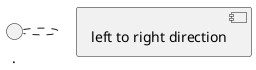

# 行业竞品调研方法论（增强版）

## 核心增强点

相比原版，本版本增加了**需求澄清对话模块**，在执行调研前通过结构化提问明确：
- 调研面向的具体场景
- 目标竞品或参考资料的权重
- 调研的深度和广度要求

---

## 第一阶段：需求澄清（必做）

### 1.1 识别输入信息

当用户发起调研请求时，首先识别用户提供的输入类型：

| 输入类型 | 权重等级 | 说明 |
|---------|---------|------|
| **A类：明确竞品名称** | ⭐⭐⭐⭐⭐ 最高 | 用户直接指定具体竞品产品（如"调研碳阻迹"） |
| **B类：明确客户场景** | ⭐⭐⭐⭐ 高 | 用户描述具体行业+场景（如"制造业设备运维"） |
| **C类：参考文档/资料** | ⭐⭐⭐ 中 | 用户上传了竞品资料、功能清单、对比表等 |
| **D类：泛化需求** | ⭐⭐ 低 | 用户只说"调研一下XX行业"，无具体信息 |

### 1.2 结构化澄清对话

根据输入类型，决定是否需要进一步澄清：

**当输入为A类（明确竞品）时：**
- 直接确认调研范围，无需多问
- 询问调研深度（概览/深度/标杆对比）

**当输入为B类（明确场景）时：**
- 追问目标客户类型（大型企业/中小企业/标杆客户）
- 询问是否有初步竞品清单
- 询问是否需要跨行业参考

**当输入为C类（参考资料）时：**
- 分析参考资料的完整性
- 询问参考资料中的产品是否都需要覆盖
- 补充询问还有什么已知信息

**当输入为D类（泛化需求）时：**
- 必须追问具体场景（什么行业？什么产品类型？）
- 必须追问目标客户（卖给谁？客户规模？）
- 引导用户缩小范围（如：是否有参考的竞品？）

### 1.3 调研目标确认

澄清后，必须与用户确认以下内容：

```
## 调研目标确认单

| 确认项 | 内容 | 状态 |
|-------|------|------|
| 调研场景 | [如：制造业设备预测性维护] | ☐待确认 |
| 目标竞品 | [竞品1、竞品2...] | ☐待确认 |
| 参考资料 | [如有上传的资料] | ☐待确认 |
| 调研深度 | [概览/深度/标杆对比] | ☐待确认 |
| 调研范围 | [是否跨行业/跨品类] | ☐待确认 |
| 输出要求 | [报告/UML图/功能清单...] | ☐待确认 |

请确认以上内容，我将开始执行调研。
```

---

## 第二阶段：七步调研法

### 第一步：确定调研对象

**两个方向：**

1. **本行业标杆调研**
   - 优先选择行业内公认的标杆产品
   - 了解行业最佳实践

2. **跨行业类似产品调研**
   - 当本行业缺乏标杆时，寻找类似领域的标杆
   - 关注业务逻辑相似性，而非行业一致性

**判断标准：**
- 谁的业务越早线上化，产品越成熟
- 优先选择有成熟SaaS产品的领域

---

### 第二步：从搜索开始

**搜索策略：**

1. **中文搜索**
   - 关键词：业务关键词 + 产品/工具
   - 平台：知乎、人人都是产品经理、少数派、36氪

2. **英文搜索（推荐）**
   - 欧美企业服务产品更丰富
   - 更容易找到框架性科普文章
   - 更容易发现已进入增长期的主流产品

3. **工具推荐**
   - DeepL：大段英文翻译更易读
   - Chrome翻译：快速浏览后切回原文

**学习目标：**
- 理解行业基础术语
- 掌握行业产业链结构
- 定位"服务商"这一产品层级

---

### 第三步：浓缩关键词

**从头部玩家官网获取：**

1. 访问头部厂商官网（如Oracle、Salesforce、SAP）
2. 提炼"产品简称"和专业术语
3. 用精炼关键词进行二次搜索

**重要概念识别：**
- 如DMP（Data Management Platform）
- 如ERP、CRM、CMS等常见企业产品类别
- 这些术语往往是行业成熟度的标志

---

### 第四步：咨询和学术领域找答案

**三大信息来源：**

| 来源 | 推荐渠道 | 价值 |
|------|---------|------|
| **咨询报告** | 艾瑞咨询、36氪、慧博、IDC、Gartner | 市场规模、产品分类、主流玩法 |
| **专业书籍** | 行业综合性书籍（如《计算广告》） | 全貌掌握、业务逻辑、技术实现 |
| **学术论文** | 研究生论文的文献综述+案例研究 | 产品图谱、更多调研线索 |

**选择原则：**
- 精读1份报告比下载10份有用
- 新且包含详实案例的文章最有价值

---

### 第五步：扩展阅读清单

**内容账号推荐：**
- anyway.fm（播客+newsletter，发现亮眼产品）
- 产品沉思录（uxcoffee播客（产品设计访谈））
- 少数派（产品体验文）

**书籍推荐原则：**
- 有详细案例
- 方法论+技术验证
- 一本书讲透一个案例（如《幕后产品》讲网易云音乐）

---

### 第六步：真实体验demo

**体验路径：**

1. **视频学习**
   - YouTube、B站、公众号、官网产品介绍视频
   - 关注产品制作者认为的用户路径

2. **产品截图与架构图**
   - 重点界面截图
   - 画产品架构脑图
   - 理解产品内在逻辑

3. **申请试用**
   - 官网申请demo账号
   - 亲身体验核心功能

---

### 第七步：从商业角度看产品

**核心区别：**

| 角度 | 关注点 |
|------|--------|
| **产品角度** | UI好不好、交互快不快、功能全不全 |
| **商业角度** | UI对商业化的作用、用户是谁、用户为什么接受、用户获得什么价值 |

**深度调研的标准：**
- 看到的是功能背后的商业价值和用户获益
- 理解产品在整个产业链中的位置
- 判断产品核心功能的价值锚点

---

## 第三阶段：输出物模板

### 调研报告结构

```
1. 调研背景
   - 调研目的
   - 调研范围
   - 调研目标确认单（来自第一阶段）

2. 行业概况
   - 市场规模
   - 产业链结构
   - 主流玩家

3. 产品分析
   - 产品定位
   - 核心功能
   - 用户群体
   - 商业模式

4. 功能对比
   - 功能矩阵表
   - 差异化分析

5. 启示与建议
   - 对自身产品的启发
   - 可借鉴的设计
   - 待超越的点

6. 参考资料
   - 调研来源
   - 阅读清单
```

---

## To B产品调研关键词库

### 常用搜索词

| 领域 | 中文关键词 | 英文关键词 |
|------|----------|-----------|
| 设备管理 | 设备管理系统、设备运维、智能运维 | CMMS, EAM, Predictive Maintenance |
| 数据分析 | 数据中台、数据平台、商业智能 | Data Platform, BI, Analytics |
| 协同办公 | 协同办公、OA、工作流 | Workflow, BPM, Collaboration |
| 供应链 | 供应链管理、仓储管理、WMS | SCM, WMS, TMS |
| 生产制造 | MES、生产执行系统、工单管理 | MES, MOM, Manufacturing |
| 能碳管理 | 碳管理、能耗管理、ESG、碳排放核算 | Carbon Management, ESG, Scope 1/2/3 |

---

## 调研输出物要求

### ⚠️ 重要：所有内容输出到同一文件

为方便管理，调研报告、UML图、功能清单对比、参考资料**全部输出到同一个 Markdown 文件**中，禁止拆分多个文件。

---

### 输出文件命名规范

```
[产品方向]调研报告-[日期].md
示例：能碳管理平台调研报告-20260610.md
```

---

### 完整调研报告模板

```markdown
# [产品方向]调研报告

> 版本：v1.0 | 日期：YYYYMMDD | 调研深度：概览/深度/标杆

---

## 一、调研目标确认单

| 确认项 | 内容 | 来源 |
|-------|------|------|
| 调研场景 | [具体场景描述] | 用户描述 |
| 目标竞品 | [竞品1、竞品2...] | A类权重优先 |
| 参考资料 | [资料名称/来源] | C类权重 |
| 调研深度 | [概览/深度/标杆对比] | 用户确认 |
| 输出要求 | [调研报告+功能清单+UML图] | 用户确认 |

---

## 二、行业概况

### 2.1 市场趋势
### 2.2 产业链结构
### 2.3 主流玩家

---

## 三、竞品分析

### 3.1 竞品列表

| 竞品名称 | 厂商 | 类型 | 官网/资料 |
|---------|------|------|----------|
| [竞品1] | [厂商] | [类型] | [链接] |
| ... | ... | ... | ... |

### 3.2 产品定位对比

| 竞品 | 定位 | 目标客户 | 核心优势 |
|------|------|---------|---------|
| [竞品1] | ... | ... | ... |

---

## 四、详细功能清单对比表

> 所有功能清单按模块汇总到此表中，便于横向对比

| 功能模块 | 功能项 | 功能详情 | 竞品A | 竞品B | 竞品C | 重要性 |
|---------|--------|---------|-------|-------|-------|--------|
| [模块1] | [功能点] | [子功能] | ✅ | ❌ | 部分 | ⭐⭐⭐ |
| ... | ... | ... | ... | ... | ... | ... |

---

## 五、UML图（PlantUML代码）

> 所有UML图使用PlantUML语法，统一放在此章节

### 5.1 用例图（Use Case）



### 5.2 活动图（Activity）

```plantuml
@startuml
...
@enduml
```



### 5.3 时序图（Sequence）


### 5.4 状态机图（State）


---

## 六、行业适配分析

| 行业/场景 | 最佳适配竞品 | 核心能力匹配度 | 可借鉴点 |
|-----------|-------------|---------------|---------|
| [场景1] | [竞品] | 高/中/低 | ... |

---

## 七、竞品对比总结

### 7.1 竞品优势
### 7.2 竞品短板
### 7.3 差异化机会

---

## 八、功能优先级建议

| 优先级 | 功能项 | 理由 |
|--------|--------|------|
| P0（必备） | ... | ... |
| P1（重要） | ... | ... |
| P2（可选） | ... | ... |

---

## 九、参考资料清单

> 格式：[序号] [标题](链接) - [来源类型] - [访问日期]

### 9.1 官网资料
1. [竞品A官网](https://xxx.com) - 官网 - YYYYMMDD
2. ...

### 9.2 行业报告
1. [报告名称](链接) - 咨询报告 - YYYYMMDD
2. ...

### 9.3 新闻资讯
1. [文章标题](链接) - 新闻 - YYYYMMDD
2. ...

### 9.4 学术论文
1. [论文标题](链接) - 学术 - YYYYMMDD
2. ...

### 9.5 视频/演示
1. [视频标题](链接) - 视频 - YYYYMMDD
2. ...

---

## 十、附录

### 10.1 术语表
### 10.2 调研方法记录
### 10.3 待深入研究项

---

> 调研完成时间：YYYYMMDD HH:mm | 调研者：[Agent]
```

---

### 功能清单来源优先级

| 来源 | 置信度 | 说明 |
|------|--------|------|
| 官网功能介绍页 | ⭐⭐⭐⭐⭐ | 最高可信 |
| 产品对比表 | ⭐⭐⭐⭐ | 官方对比数据 |
| 行业分析报告 | ⭐⭐⭐⭐ | 第三方客观分析 |
| 用户评价/评测 | ⭐⭐⭐ | 真实用户反馈 |
| demo视频 | ⭐⭐⭐ | 功能展示 |
| 猜测/推断 | ⭐ | 不确定，需验证 |

---

### UML图类型说明

| 图类型 | 用途 | 关键字 |
|--------|------|--------|
| **用例图** | 展示用户与系统的交互场景 | `usecase` |
| **活动图** | 展示业务流程和决策分支 | `start`/`stop`/`if`/`fork` |
| **时序图** | 展示用户-系统-后台的交互顺序 | `actor`/`participant`/`->` |
| **状态机图** | 展示实体对象的状态流转 | `state`/`[*]`/`->` |

---

## 常见问题

**Q: 本行业竞品太少怎么办？**
A: 扩展到业务逻辑相似的其他行业。如房地产数据产品复杂，但可参考线上营销广告类数据产品。

**Q: 竞品不开放试用怎么办？**
A: 通过官网demo视频、产品截图、行业报告、用户评价等多种渠道综合了解。

**Q: 如何判断调研是否充分？**
A: 能画出目标产品的架构图，能说清产品的核心价值和用户群体，能提出3个以上的借鉴点或差异化方向。

**Q: UML图用什么格式输出？**
A: 使用PlantUML语法编写，渲染为PNG图片或直接输出Mermaid代码。可用draw.io工具打开编辑。

**Q: 功能清单来源有哪些？**
A: ①官网功能介绍页；②产品对比表；③行业分析报告；④用户评价/评测文章；⑤demo视频中的功能展示。
